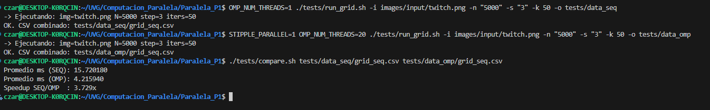
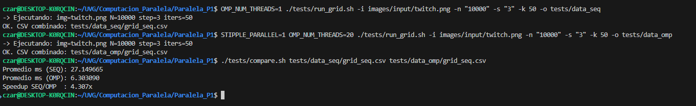
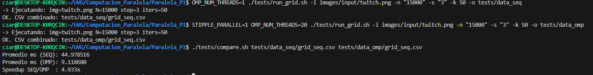
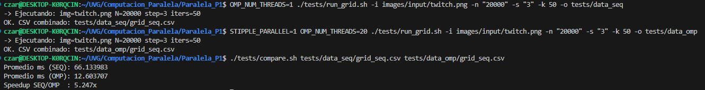
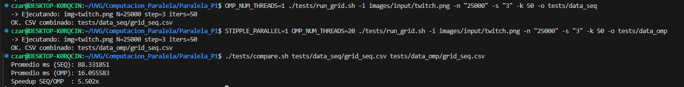

# Bitácora de pruebas
### Se realizaran medidas con los siguientes parametros: 
- i (iamgen de entrada): 

        images/input/twitch.png

- s (step, stride en pixeles al barrer la imagen): 

        3

- k (numero de iteraciones auto-run del algoritmo lloyd): 

        50

- n (numero de puntos):
        
         con cada medicion ira variando (+5000)

#### Comando secuencial: 
```
OMP_NUM_THREADS=1 ./tests/run_grid.sh -i images/input/twitch.png -n "5000" -s "3" -k 50 -o tests/data_seq
```

#### Comando Paralelo: 
```
STIPPLE_PARALLEL=1 OMP_NUM_THREADS=20 ./tests/run_grid.sh -i images/input/twitch.png -n "5000" -s "3" -k 50 -o tests/data_omp
```

#### Comando para comparacion: 
```
./tests/compare.sh tests/data_seq/grid_seq.csv tests/data_omp/grid_seq.csv
```
## Medicion # 1 - N = 5,000

- Promedio Secuencial: 
- Promedio Paralelo:



## Medicion # 2 - N = 10,000

- Promedio Secuencial: 
- Promedio Paralelo:



## Medicion # 3 - N = 15,000

- Promedio Secuencial: 
- Promedio Paralelo:



## Medicion # 4 - N = 20,000

- Promedio Secuencial: 
- Promedio Paralelo:




## Medicion # 5 - N = 25,000

- Promedio Secuencial: 
- Promedio Paralelo:


