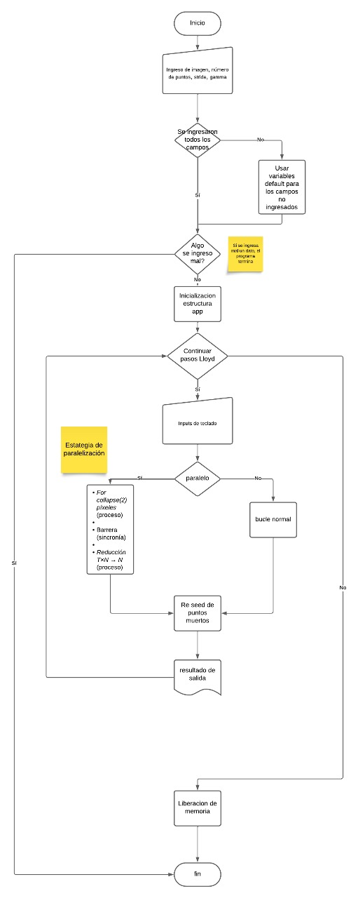
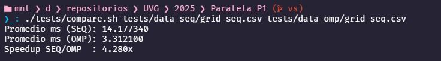
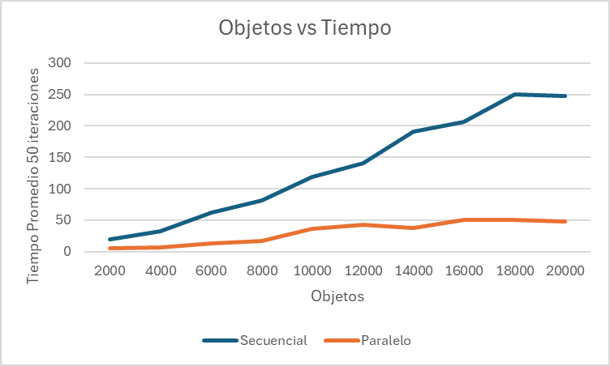

## Índice

- [Algoritmo Matemático: Voronoi Stippling](#algoritmo-matemático-voronoi-stippling)
- [Referencias y Documentación Voronoi Stippling](#documentación-voronoi-stippling)
- [Estrategia de paralelización](#estrategia-de-paralelización-voronoi-stippling)
- [Documentación de código: Headers](#api-de-headers--voronoi-stippling)
- [Documentación de código: App](#appc--documentación-técnica)
- [Documentación de código: Lloyd](#lloydc--iteración-de-lloyd-ponderada-por-imagen)
- [Documentación de código: Voronoi](#voronoic--índice-espacial-y-consulta-de-vecino-más-cercano)
- [Documentación de código: Stippling](#stipplingc--documentación-del-módulo)
- [Documentación de código: Image](#imagec--carga-y-muestreo-de-imágenes)
- [Documentación de código: Utils](#utilsc--utilidades-de-fs-tiempo-y-csv)
- [Resultados, Conclusiones y Recomendaciones](#resultados)

## Introducción

Este proyecto implementa Voronoi–Lloyd Stippling, una técnica que aproxima imágenes usando nubes de puntos cuya densidad refleja la luminancia. Partiendo de puntos iniciales aleatorios, en cada iteración se construye un diagrama de Voronoi, se calcula el centro de masa ponderado por la imagen y se reubican los puntos (algoritmo de Lloyd), hasta converger a una distribución estable y estética. Para acelerar el proceso en imágenes grandes y con muchos puntos, se aplica paralelización con OpenMP: el barrido de píxeles, las asignaciones al vecino más cercano (aceleradas con una grilla uniforme) y las reducciones para centroides se ejecutan en paralelo, logrando mejoras de rendimiento significativas sin sacrificar calidad visual. El resultado es un render "estippling" controlable (stride, gamma, radios) y reproducible, adecuado para visualización interactiva y experimentación.



# Algoritmo Matemático: Voronoi Stippling

## 1. Diagramas de Voronoi (Región de Influencia)

Un diagrama de Voronoi divide el plano en regiones $C_i$, cada una asociada a un punto $p_i = (x_i, y_i)$, donde

El criterio de distancia $d$ puede ser:

- Euclidiana: $\sqrt{(x - x_i)^2 + (y - y_i)^2}$
- Chebyshev: $\max(|x - x_i|, |y - y_i|)$
- Manhattan: $|x - x_i| + |y - y_i|$
  ([Extra Polynymous][1])

## 2. Algoritmo de Lloyd (Centroidal Voronoi Tessellation)

Para uniformizar la distribución de puntos se aplica Lloyd iterativamente:

1. Construir el diagrama de Voronoi.
2. Calcular el centroide geométrico de cada región:

3. Reubicar $p_i$ en $(\bar{x}_i, \bar{y}_i)$.
   Se repite hasta convergencia.
   ([Extra Polynymous][1])

## 3. Weighted Voronoi Stippling (por imagen)

En lugar del centroide geométrico, se calcula el centro de masa ponderado según la imagen:

con $I(x, y)$ como brillo o intensidad.
([Extra Polynymous][1])

## 4. Multiplicatively Weighted Voronoi (tamaños variables)

Para dotar de distintos tamaños (radios $r_i$) a los puntos, el diagrama considera:

Así se logra una separación proporcional al tamaño.
([Extra Polynymous][1])

## 5. Anisotropía (distorsión direccional)

Introducción de anisotropía con razón $\alpha$ y ángulo $\theta$:

Esto genera regiones alargadas en dirección preferida.
([Extra Polynymous][1])

## 6. Implementación simple iterativa

Definir campos sobre la imagen (radio $R(x, y)$, ángulo $\theta(x, y)$, anisotropía $\alpha(x, y)$), luego:

1. Posicionar aleatoriamente $N$ puntos.
2. En cada iteración:

   - Obtener $R_i, \theta_i, \alpha_i$ según posición.
   - Construir Voronoi ponderado/anisotrópico.
   - Calcular centro de masa (o centroide).
   - Mover $p_i$ al nuevo punto.
3. Repetir hasta convergencia o límite de iteraciones.
   ([Extra Polynymous][1], [Extra Polynymous][1])

## 7. Ajuste de conservación de densidad

Para mantener la "oscuridad total" igual a la densidad visual, se escala uniformemente todo con factor $\rho$, asegurando:

Así la densidad de puntos representa la luminosidad de la imagen.
([Extra Polynymous][1])

## 8. Versión escalonada ("Better implementation")

1. Partir con campos iniciales $R_0(x,y), \theta_0(x,y), \alpha_0(x,y)$ y una imagen $I_0$ de área $A_0$.
2. Establecer un número objetivo de puntos $N_f$.
3. Iterativamente:

   - Generar $N_2$ temporales con escalamiento proporcional a imagen/área.
   - Calcular Voronoi y centro de masa, determinar oscuridad $D_i$ y radio medio $\bar{R}_i$.
   - Usar factor:

     $$
     c = \frac{\sum_{i=1}^{N_2} D_i}{\sum_{i=1}^{N_2} \pi \,\bar{R}_i^{\,2}}
     $$

     y asignar nuevos puntos por región:

     $$
     N_i = \operatorname{round}\!\left(\frac{D_i}{c \,\pi\, \bar{R}_i^{\,2}}\right),
     \qquad
     N = \sum_{i=1}^{N_2} N_i
     $$

   - Redistribuir aleatoriamente los $N_i$ dentro de cada región.
   - Aplicar iteraciones de Lloyd primero dentro de subregiones y luego en todo el campo.
4. Repetir hasta alcanzar $N \geq N_f$.
   Esta aproximación gradual mejora la eficiencia y la convergencia.
   ([Extra Polynymous][1])

## Resumen matemático clave

| Caso                   | Distancia modificada                  | Actualización de puntos     |
| ---------------------- | ------------------------------------- | --------------------------- |
| Lloyd clásico          | Euclidiana estándar                   | Centroide                   |
| Weighted stippling     | Euclidiana + ponderación de imagen    | Centro de masa              |
| Multiplicative weights | Euclidiana escalada por $s = 1 / r_i$ | Incluido en cálculo Voronoi |
| Anisotropic            | Distorsión por $\alpha, \theta$       | Incluido en cálculo Voronoi |

[1]: https://estebanhufstedler.com/2020/01/11/modfied-voronoi-diagrams-and-stippling/?utm_source=chatgpt.com "Modfied Voronoi Diagrams and Stippling – Extra Polynymous"

# Documentación Voronoi Stippling

## Descripción general

**Stippling** es una técnica de representación gráfica donde una imagen o figura se aproxima usando **puntos distribuidos en el plano**.
El objetivo es que la **densidad y posición de los puntos** transmitan la estructura, contraste y detalles de la imagen.

Para lograr esto de manera algorítmica, se combina:

- **Diagramas de Voronoi** → dividen el plano en celdas según cercanía a cada punto semilla.
- **Algoritmo de Lloyd** → ajusta iterativamente la posición de los puntos hacia el **centroide o centro de masa** de su celda Voronoi.
- **Pesos derivados de la imagen** → las áreas oscuras atraen más puntos, generando mayor densidad (Weighted Voronoi Stippling).

## Parámetros principales del algoritmo

1. **N**: número de puntos iniciales (parámetro clave del proyecto).
2. **Imagen de entrada (opcional)**: define la densidad de puntos por oscuridad/brillo. Si no hay imagen, se puede trabajar con distribuciones uniformes o funciones matemáticas.
3. **Iteraciones (I)**: número de repeticiones de Lloyd’s Algorithm hasta converger.
4. **Distancia usada**:

   - Euclidiana (clásico).
   - Chebyshev o Manhattan (variantes).
5. **Pesos/funciones**:

   - **Weighted**: ponderación según intensidad (1 − I(x,y)).
   - **Multiplicatively weighted**: cada punto tiene un factor de escala → permite simular diferentes tamaños de puntos.
   - **Anisotrópico**: distancias escaladas por un ángulo θ y razón α, para estiramiento direccional.

## Funcionamiento (flujo básico)

1. Inicializar **N puntos aleatorios** en el área de la imagen/canvas.
2. **Construir el diagrama de Voronoi** con esos puntos.
3. Para cada celda Voronoi:

   - Calcular el **centroide geométrico** (si uniforme).
   - Calcular el **centro de masa ponderado** (si depende de imagen).
4. Mover cada punto al centroide/centro de masa de su celda.
5. Repetir el proceso hasta convergencia o un número fijo de iteraciones.
6. Renderizar los puntos (círculos o dots).

## Retornos / Resultados

- **Distribución final de puntos** (coordenadas 2D).
- Imagen stippled que aproxima la forma o gradientes de la imagen de entrada.
- En versión animada (*screensaver*), se visualiza la evolución iterativa (los puntos "se deslizan" hacia posiciones más uniformes/densas según la imagen).

## Variantes importantes

- **Lloyd’s Algorithm (Centroidal Voronoi Tessellation)**: puntos uniformemente distribuidos.
- **Weighted Voronoi Stippling**: más puntos en áreas oscuras.
- **Multiplicatively Weighted Voronoi**: permite puntos de distinto tamaño.
- **Anisotropy**: genera patrones direccionales (líneas o texturas).

## Reto y propósito del algoritmo

El reto de **Voronoi Stippling** es convertir imágenes o áreas en representaciones basadas **únicamente en puntos**, distribuidos de manera **eficiente y visualmente coherente**.

Esto implica resolver problemas de:

- **Distribución espacial**: mantener puntos equidistantes evitando agrupamientos innecesarios.
- **Convergencia rápida**: el algoritmo puede ser costoso con miles de puntos.
- **Visualización estética**: los puntos deben transmitir la información visual de manera clara.

En el contexto de tu proyecto de **paralela con OpenMP**, el reto es:

- Computar las celdas Voronoi o aproximaciones para cada iteración.
- Recalcular centroides/centros de masa de manera eficiente.
- Paralelizar el procesamiento de celdas/puntos para acelerar la convergencia.

## Referencias útiles

- [Esteban Hufstedler: *Modified Voronoi Diagrams and Stippling*](https://estebanhufstedler.com/2020/01/11/modfied-voronoi-diagrams-and-stippling/) (conceptos de Lloyd, Weighted, Anisotropy)
- [Mike Bostock – ObservableHQ: *Voronoi Stippling*](https://observablehq.com/@mbostock/voronoi-stippling) (visualización interactiva paso a paso).
- [The Coding Train (Challenge #181 – Image Stippling)](https://thecodingtrain.com/challenges/181-image-stippling): explicación pedagógica y animada.
- [Repositorio de referencia en JS](https://github.com/smallwhale1/voronoi-stippling?tab=readme-ov-file)

# Estrategia de paralelización *Voronoi Stippling*

## 1. Secuencial vs. Paralelizable

### Secuencial

- **Lectura y preprocesamiento de la imagen**:
  Conversión a formato homogéneo (`RGBA32`) y cálculo de luminancia Rec.709 en espacio lineal. Es un paso único, dependiente de SDL/SDL_image.

- **Inicialización de puntos**:
  Distribución uniforme pseudoaleatoria vía LCG. Determinista (misma semilla → misma nube).

- **Iteración de Lloyd (barrido secuencial)**:

  - Se recorre el canvas en pasos de `step` píxeles.
  - Para cada muestra se calcula luminancia → peso $w = (1 - \text{lum})^\gamma$ o $w = (\text{lum})^\gamma$.
  - Se busca el vecino más cercano (grilla uniforme con fallback O(N)).
  - Se acumulan sumatorias (`sumX`, `sumY`, `sumW`) de manera secuencial.
  - Al final, cada punto se mueve a su centroide.

- **Sincronización natural**:
  Al ser secuencial, no existen condiciones de carrera. Solo al final de cada iteración se actualizan las posiciones.

### Paralelizable

- **Barrido del canvas**:
  El doble bucle `(y,x)` se paraleliza con `#pragma omp parallel for`. Cada hilo procesa subconjuntos de píxeles.

- **Buffers privados por hilo**:
  Para evitar *race conditions*, cada hilo mantiene su propio arreglo de acumuladores (`sumX`, `sumY`, `sumW`) y al final se realiza una **reducción explícita** combinando resultados.

- **Reubicación de puntos**:
  La actualización de cada punto al centroide es independiente → puede hacerse también en paralelo.

## 2. Estrategias de paralelización

- **Paralelismo de datos (MIMD):**
  Cada muestra de la imagen se procesa de forma independiente → ideal para `parallel for`.

- **Reducciones manuales:**
  En lugar de usar `reduction(+:var)` directo, el diseño usa buffers por hilo y luego combina resultados → más control y mejor escalabilidad cuando `N` es grande.

- **Uso de índices espaciales (grilla uniforme):**
  Reduce el número de comparaciones para *nearest neighbor*, mejorando el rendimiento tanto en la versión secuencial como en paralelo.

## 3. Directivas de OpenMP y estructuras de datos

- **Paralelismo por bucle:**

  ```c
  #pragma omp parallel for schedule(static)
  for (int y = 0; y < H; y += step) {
      for (int x = 0; x < W; x += step) {
          // cálculo de luminancia + peso
          // búsqueda de vecino más cercano
          // acumulación en buffers privados
      }
  }
  ```

- **Estructuras de datos:**

  - Arreglos planos (`double* sumX, sumY, sumW`) de tamaño `N`.
  - Buffers replicados por hilo (`T x N`), luego reducidos al final.
  - Grilla uniforme (`UniformGrid`) para acelerar consultas NN.

## 4. Justificación técnica

- **Por qué `parallel for` en el barrido:**
  El cálculo de luminancia y asignación Voronoi es homogéneo y repetitivo, ideal para repartir entre hilos.

- **Por qué buffers privados por hilo:**
  Evitan bloqueos y *false sharing*. La reducción final es lineal y no afecta la escalabilidad.

- **Por qué arreglos contiguos:**
  El acceso secuencial favorece caché y permite vectorización automática.

- **Por qué grilla uniforme:**
  Reduce el costo de búsqueda de $O(N)$ a $O(k)$, donde $k$ << $N$.

# API de headers – Voronoi Stippling

> Convenciones
>
> - Coordenadas en píxeles, origen arriba-izquierda.
> - Rangos válidos: `x ∈ [0,w)`, `y ∈ [0,h)`.
> - Todas las funciones `bool` retornan `true` en éxito, `false` en error.
> - Punteros de salida: no deben ser `NULL`.

## `include/app.h`

**Rol:** ciclo de vida (init → loop → shutdown).

### Tipos

```c
typedef struct App App;  /* tipo opaco */
````

### Funciones

```c
bool appInit(App **outApp,
             int width, int height,
             const char *title,
             const char *imagePath,
             int npoints);
```

- Crea ventana/renderer (SDL2), inicializa SDL_image, carga imagen (`imagePath` o `defaultImagePath`) e inicializa la nube con `npoints` (o `defaultNPoints`).

```c
void appRun(App *app);
```

- Bucle principal: eventos → paso(s) de Lloyd (manual/auto) → render.

```c
void appShutdown(App *app);
```

- Libera puntos, texturas/superficies, renderer/ventana y cierra SDL/SDL_image.

**Controles (runtime):**

- `SPACE` paso Lloyd
- `A` auto
- `-`/`+` step
- `G`/`H` gamma
- `B` fondo
- `Z`/`X` radio
- `R` reseed
- `P` screenshot
- `C` color ON/OFF
- `I` tema
- `N`/`M` minR -/+
- `,`/`.` maxR -/+
- `ESC` salir.

## `include/config.h`

**Rol:** defaults (fallback si no se pasan por CLI).

```c
#define defaultWidth     800
#define defaultHeight    600
#define defaultTitle     "Voronoi Stippling - bootstrap"
#define defaultImagePath "images/input/twitch.png"

#define defaultNPoints   1000
#define defaultLloydStep 3     /* k de muestreo; 1 preciso, 3–4 rápido */
#define defaultGamma     1.0f  /* exp. del peso */
```

**Peso nativo de Lloyd (build-time):**

```c
/* 1 -> w = luminancia^gamma (favorece claros)
 * 0 -> w = (1 - luminancia)^gamma (favorece oscuros) */
#ifndef STIPPLE_WEIGHT_BY_BRIGHTNESS
#define STIPPLE_WEIGHT_BY_BRIGHTNESS 1
#endif
```

Notas:

- `defaultLloydStep` controla costo/calidad por iteración.
- Con `STIPPLE_WEIGHT_BY_BRIGHTNESS==1`: `gamma>1` enfatiza zonas **claras**; con `0`: `gamma>1` enfatiza **oscuras**.

## `include/image.h`

**Rol:** carga y muestreo de imagen.

### Tipo

```c
typedef struct {
  int w, h;           /* dimensiones px */
  int pitchPixels;    /* pitch/4 en RGBA32 */
  Uint32 *pixels;     /* buffer RGBA8888 */
  SDL_Surface *surface;
} Image;
```

### Funciones

```c
bool  imageLoad(Image *img, const char *path);
void  imageFree(Image *img);
float sampleIntensity(const Image *img, int x, int y);
float sampleIntensityBilinearUV(const Image *img, float u, float v);
void  sampleRgbBilinearUV(const Image *img, float u, float v,
                          Uint8 *r, Uint8 *g, Uint8 *b);
```

Notas:

- `imageLoad` convierte a `SDL_PIXELFORMAT_RGBA32`.
- Luma = Rec.709 en `[0..1]` sobre **RGB lineal** (se hace sRGB→lineal internamente).
- `sample*UV` usa bilineal en `u,v ∈ [0,1]` (evita aliasing al mapear canvas↔imagen).

## `include/stippling.h`

**Rol:** estado/render de la nube de puntos.

### Tipos

```c
typedef struct { float x, y; } Dot;

typedef struct {
  Dot *pts;
  int  count, width, height;
} Stippling;
```

### Funciones

```c
bool stipplingInit(Stippling *s, int n, int w, int h, unsigned seed);
void stipplingFree(Stippling *s);

/* Render "estilizado": radio por brillo y color opcional de la imagen */
void stipplingRenderStyled(const Stippling *s, SDL_Renderer *ren, int canvasW, int canvasH,
                           const Image *img, float minR, float maxR,
                           bool useColor, bool invertTheme);
```

Notas:

- `stipplingRenderStyled`: radio por punto `radius = minR + (1 - luma)*(maxR - minR)`; si `useColor==true`, toma `r,g,b` bilineal de la imagen; `invertTheme` alterna base claro/oscuro en monocromo.

## `include/lloyd.h`

**Rol:** una iteración de Lloyd ponderada por imagen.

```c
bool lloydStep(const Image *img,
               Stippling *s,
               int w, int h,
               int pixelStride,
               float gamma);
```

- Muestrea el lienzo `(w×h)` cada `pixelStride` px; asigna cada muestra a su punto más cercano (acelerado por grilla) y acumula centroide con peso:

  - si `STIPPLE_WEIGHT_BY_BRIGHTNESS==1`: `w = luminancia^gamma`;
  - si `==0`: `w = (1 - luminancia)^gamma`.
- Actualiza cada punto al centro de masa ponderado.

**Coste aprox.:** `O((w/stride * h/stride) * k)`, `k` = puntos en celdas vecinas (grilla uniforme).

## `include/voronoi.h`

**Rol:** índice espacial (grilla uniforme) para vecino más cercano.

### Tipo

```c
typedef struct {
  int w,h, cell, cols, rows;
  int *head; /* cols*rows, -1 si vacia */
  int *next; /* s->count, enlaza puntos por celda */
} UniformGrid;
```

### Funciones

```c
bool gridBuild(UniformGrid *g, int w, int h, int cell, const Stippling *s);
void gridFree(UniformGrid *g);
int  gridNearest(const UniformGrid *g, const Stippling *s, float x, float y, int ringMax);
```

Notas:

- `gridBuild`: O(N). Reconstruir si los puntos se mueven mucho (cada iteración de Lloyd).
- `gridNearest`: explora anillos de celdas hasta `ringMax`; retornar `-1` implica ampliar `ringMax` o fallback O(N).

# `app.c` — Documentación técnica

## Resumen

`app.c` orquesta la aplicación gráfica *Voronoi Stippling*. Se encarga de:

- Inicializar/cerrar SDL y SDL_image.
- Crear ventana, renderer y recursos de imagen.
- Mantener el estado de la simulación (puntos, iteraciones, parámetros).
- Bucle por frame:
  - entrada (teclado/ventana)
  - simulación (Lloyd manual/auto)
  - render (fondo + puntos) y captura opcional.
- Mostrar métricas (FPS, iteraciones, parámetros) en el título.

## Flujo de alto nivel

```text
appInit(...) -> appRun(app) -> appShutdown(app)
```

## Estructura `App`

```c
struct App {
  // SDL
  SDL_Window   *win;
  SDL_Renderer *ren;

  // Canvas
  int w, h;

  // Tiempo/FPS
  Uint64 freq, last;
  double accTime, lastFpsUpdate;
  int    frames;

  // Imagen + puntos
  Image     image;
  SDL_Texture *imageTex;
  Stippling stip;

  // Visual
  bool  colorPoints;   // colorear cada punto desde la imagen
  bool  invertTheme;   // alterna fondo claro/oscuro y base de puntos
  float minRadius;     // radio mínimo por punto (estilizado)
  float maxRadius;     // radio máximo por punto (estilizado)

  // Lloyd
  bool  autoRun;
  int   iters;
  int   pixelStride;   // k >= 1
  float gammaW;        // (1 - luminancia)^gamma
  unsigned seed;       // para reseed (R)

  // Render/utilidades
  bool showBg;
  int  dotRadius;      // radio fijo (si no se usa el estilizado)
  bool wantScreenshot;

  // Batch/medición
  int   maxIters;      // 0 -> sin tope
  char *metricsPath;   // CSV (si no NULL)

  // Sweep de gamma (batch/testing)
  bool  sweepGamma;
  float gStart, gEnd, gStep;
  int   gEvery;        // aplicar cada N iteraciones

  // --- Overlay FPS
  TTF_Font    *font;         // fuente para texto
  SDL_Texture *fpsTex;       // textura cacheada del texto "FPS: ... "
  int          fpsTexW;
  int          fpsTexH;
  double       lastFpsOverlayUpdate; // última vez que refrescamos el texto

  // --- Lista de fondos
  char  **bgPaths;
  int     bgCount;
  int     bgIndex;

  double bgTimer;    // segundos acumulados desde el último cambio
  double bgPeriod;   // cada cuántos segundos cambiar de imagen (>0 activa)
};
```

**Notas:**

- Los recursos viven entre `appInit` y `appShutdown`.
- `minRadius/maxRadius`, `colorPoints`, `invertTheme` afectan el render "estilizado".
- `metricsPath`, `maxIters` y el *sweep* de gamma permiten ejecuciones batch con logging.

## Inicialización — `appInit`

Hace:

- `SDL_Init(SDL_INIT_VIDEO | SDL_INIT_TIMER)` y `IMG_Init(PNG | JPG)`.
- Crea ventana y renderer acelerado (con VSYNC si hay).
- Carga imagen (si falla, se puede continuar sin fondo) y crea textura.
- Inicializa nube de puntos (`stipplingInit`).
- Define defaults: `autoRun=false`, `pixelStride=defaultLloydStep`, `gammaW=defaultGamma`, `minRadius=0.8`, `maxRadius=3.0`, etc.
- Imprime ayuda de teclas en consola.

**Variables de entorno soportadas:**

- `STIPPLE_AUTORUN=1` -> arranca en auto.
- `STIPPLE_MAX_ITERS=N` -> tope de iteraciones (batch).
- `STIPPLE_METRICS=path.csv` -> log por iteración (se crea encabezado si no existe).
- Sweep de gamma:

  - `STIPPLE_GAMMA_START=<f>` (opcional),
  - `STIPPLE_GAMMA_END=<f>` (requiere),
  - `STIPPLE_GAMMA_STEP=<f>` (requiere),
  - `STIPPLE_GAMMA_EVERY=<int>` (opcional; default=1).

## Título y FPS — `updateFpsTitle`

- Formatea: `FPS`, `it`, `step`, `gamma`, `r` (radio fijo), `minR/maxR`, y flags `[COLOR]` / `[INVERT]`.
- Se actualiza aprox. cada 0.25 s desde `appRun`.

## Capturas — `saveScreenshot`

- Asegura `images/output/`.
- Copia el *framebuffer* a un `SDL_Surface` RGBA32 y guarda `PNG`.
- Nombre: `images/output/stipple_XXXXX.png` (`XXXXX = iters`).
- Debe llamarse al final del frame para capturar lo que se ve.

## Fondos rotables

- `appSetBackgroundList`
  - Copia y guarda la lista y carga el primer fondo
- `appNextBackground`, `appPrevBackground`
  - Avanza/retrocede circularmente y carga el fondo.

## Bucle principal — `appRun`

**Por frame:**

1. **Entrada**

   - `SDL_PollEvent`: `SDL_QUIT` y `SDL_KEYDOWN`.
   - **Atajos de teclado:**
     - `ESC` -> salir.
     - `SPACE` -> 1 paso de Lloyd (con timing + CSV si activo).
     - `A` -> auto ON/OFF.
     - `-` / `+` (incluye keypad y `=`) -> `pixelStride` down/up.
     - `G` / `H` -> `gammaW` up/down.
     - `B` -> alterna `showBg`.
     - `Z` / `X` -> `dotRadius` down/up.
     - `R` -> reseed con nueva `seed`.
     - `P` -> marcar captura del frame.
     - `C` -> alterna `colorPoints` (color real de la imagen).
     - `I` -> alterna `invertTheme` (tema claro/oscuro).
     - `N` / `M` -> `minRadius` -/+ (clamp `[0.5, maxRadius]`).
     - `,` / `.` -> `maxRadius` -/+ (clamp `[minRadius, 20]`).

2. **Simulación:**

   - Calcula `dt`, acumula `accTime` y `frames`.
   - Si `autoRun`, ejecuta `lloydStep` (mide tiempo, loguea si `metricsPath`).
   - Aplica sweep de gamma si está activo (cada `gEvery` iters).

3. **Render:**

   - Fondo sólido o imagen (según `showBg` e `imageTex`), respetando `invertTheme`.
   - Dibuja puntos con `stipplingRenderStyled(...)` usando:

     - `minRadius/maxRadius`, `colorPoints`, `invertTheme`, y brillo local de la imagen.

   - Si `wantScreenshot`, guarda PNG y limpia el flag.
   - `SDL_RenderPresent()`.

**Notas:**

- `lloydStep` usa muestreo bilineal UV y *UniformGrid* para *nearest neighbor*.
- `pixelStride` balancea costo/calidad (3–4 suele ir bien).

## Cierre — `appShutdown`

Orden:

1. `stipplingFree`
2. `SDL_DestroyTexture`, `imageFree`, `SDL_DestroyRenderer`, `SDL_DestroyWindow`
3. `IMG_Quit`, `SDL_Quit`
4. `free(app)`

Idempotente a nivel de punteros internos; no-op si `app == NULL`.

## Interacción con otros módulos

- `image.c`: carga y muestreo (luminancia/ RGB bilineal).
- `lloyd.c`: paso de Lloyd con ponderación por oscuridad y reseed de huérfanos.
- `voronoi.c`: *UniformGrid* para acelerar NN.
- `stippling.c`: estado y render (incluye versión "estilizada" por brillo/color).

## Parámetros clave en runtime

- `pixelStride` (>=1): más alto -> más rápido/menos preciso por paso.
- `gammaW`: >1 concentra en zonas oscuras; <1 aplanado.
- `minRadius/maxRadius`: controlan el rango de radios por punto (estilizado).
- `colorPoints`: ON -> usa color real; OFF -> monocromo según tema.
- `invertTheme`: alterna fondo claro/oscuro y base de puntos.
- `autoRun`: ejecuta Lloyd en cada frame.

## Registro y errores

- Errores a `stderr`.
- Info/ayuda y confirmaciones a `stdout` (p. ej., captura guardada).
- CSV (si `metricsPath`) con encabezado auto y filas `iter,ms,step,gamma,npoints`.

# `lloyd.c` — Iteración de Lloyd ponderada por imagen

Este módulo ejecuta **una iteración** del algoritmo de Lloyd (Centroidal Voronoi) para *Voronoi Stippling* usando la imagen como campo de densidad. Cada punto se desplaza al **centro de masa** de su región, ponderando por luminancia.

## Firma

```c
bool lloydStep(const Image *img,
               Stippling *s,
               int W, int H,
               int step,
               float gamma);
```

- `img`  → imagen fuente (RGBA32). La luminancia se muestrea en UV con **bilineal** (en lineal, ver `image.c`).
- `s`    → nube de puntos a modificar in-place.
- `W,H`  → dimensiones del canvas (en píxeles).
- `step` → stride de muestreo del canvas (≥ 1). Mayor = más rápido, menos fino.
- `gamma`→ exponente del peso (ver más abajo).

**Retorna** `true` si se ejecutó la iteración; `false` ante parámetros inválidos o fallo de memoria temporal.

## Modo de ponderación (compile-time)

La función soporta dos esquemas, seleccionables en compilación:

```c
// 1 = por brillo (modo "debug/nativo"), 0 = por oscuridad (modo clásico)
#ifndef STIPPLE_WEIGHT_BY_BRIGHTNESS
#define STIPPLE_WEIGHT_BY_BRIGHTNESS 1
#endif
```

- **Brillo (nativo/debug):** `w = (lum)^gamma`
  Favorece zonas **claras**.
- **Oscuridad (clásico):** `w = (1 - lum)^gamma`
  Favorece zonas **oscuras**.

`gamma > 1` enfatiza el modo elegido; `gamma < 1` lo atenúa.

> Nota: la luminancia `lum` proviene de `sampleIntensityBilinearUV`, que convierte sRGB→lineal y aplica Rec.709 antes de interpolar.

## Flujo interno

1. **Validación** de entradas.
2. **Grilla uniforme** (`UniformGrid`) para acelerar *nearest neighbor*; cell=32 px.
3. **Acumuladores** por punto: `sumX`, `sumY`, `sumW` en `double`.
4. **Barrido** del canvas cada `step`:

   - Convertir `(x,y)` → `(u,v)` centrado en el píxel.
   - Muestrear `lum` con **bilineal**.
   - Calcular `w` según macro (brillo u oscuridad) y `gamma`.
   - Buscar **punto más cercano** con la grilla (`ringMax=2`); si no hay candidatos, fallback O(N).
   - Acumular `(x*w, y*w, w)` en el punto ganador.
5. **Actualizar** cada punto con su centroide si `sumW[i] > 0`.
6. **Reseed** de huérfanos (`sumW == 0`): elegir hasta 64 posiciones aleatorias con `w > 1e-6`.
7. **Liberar** buffers y grilla.

## Complejidad

```bash
O( (W/step * H/step) * k )
```

donde `k` es la cantidad de puntos inspeccionados por la grilla (pequeña con `ringMax` bajo).
`step` reduce linealmente el coste del barrido.

## Detalles numéricos

- Acumulación en `double`; posiciones de puntos en `float`.
- Muestreo de luminancia en **lineal** (sRGB→lineal + Rec.709) dentro de `image.c`.
- La grilla se reconstruye en cada iteración (los puntos se mueven).

## Reseed de huérfanos

Para puntos sin asignaciones (`sumW==0`):

- Semilla reproducible: `(n ^ W ^ H) + 0x9E3779B9`.
- Hasta 64 intentos; se acepta el primer `(rx,ry)` con `w > 1e-6`.

## Consideraciones prácticas

- Iteraciones tempranas: `step = 3..4` acelera; al final, refinar con `step = 1`.
- `gamma` típico: `1.0..1.6` (ajustar según el modo de peso deseado).
- Si compilas con `STIPPLE_WEIGHT_BY_BRIGHTNESS=1`, el resultado tenderá a **zonas claras**; con `0`, a **zonas oscuras**.

## Interacción con otros módulos

- `image.c` → `sampleIntensityBilinearUV` (bilineal en UV, lineal/Rec.709).
- `voronoi.c` → `gridBuild`, `gridNearest`, `gridFree`.
- `stippling.c` → estructura y almacenamiento de puntos.

# `voronoi.c` — Índice espacial y consulta de vecino más cercano

Módulo que implementa una **grilla uniforme** para acelerar la búsqueda del punto más cercano (NN) durante Lloyd. No toca la imagen; solo indexa y consulta la **nube de puntos** (`Stippling`).

## Estructura de datos: `UniformGrid`

La grilla divide el canvas `w × h` en celdas cuadradas de lado `cell` (px).
Cada celda guarda una lista enlazada (implícita) con los índices de puntos que caen en ella.

```c
typedef struct {
  int w, h;       // tamaño del canvas (px)
  int cell;       // lado de celda (px), p.ej. 32
  int cols, rows; // número de columnas y filas

  int *head;      // head[cy*cols + cx] -> primer punto o -1 si vacío
  int *next;      // next[i] -> siguiente punto en la celda, o -1
} UniformGrid;
```

**Invariantes:**

- `head` tiene tamaño `cols*rows`.
- `next` tiene tamaño `s->count` (un enlace por punto).
- Cada punto `i` aparece **a lo sumo una vez** en su lista de celda.

**Notas:**

- No es thread-safe.
- Las coordenadas de puntos están en el mismo espacio de pantalla que la grilla.

## Construcción de la grilla

```c
bool gridBuild(UniformGrid *g, int w, int h, int cell, const Stippling *s);
```

**Qué hace:**

Inicializa `g` para cubrir `w × h` con celdas de lado `cell` y **bucketiza** todos los puntos de `s`.

**Flujo:**

1. `cols = ceil(w/cell)`, `rows = ceil(h/cell)`
2. Reserva `head[cols*rows]` y `next[s->count]`
3. Inicializa `head` con `-1`
4. Para cada punto `i`: calcula celda `(cx, cy)` y hace *push-front* en O(1).

**Clamping:**

Si algún punto cae fuera de `[0..w)×[0..h)`, se **clampa** a la celda válida más cercana (usa `clampi`).

**Complejidad:**

- Tiempo: `O(cols*rows + N)`
- Memoria: `O(cols*rows + N)`

**Retorno:**

`true` en éxito; `false` si hay parámetros inválidos o falla de memoria (libera lo parcialmente asignado).

## Búsqueda de vecino más cercano

```c
int gridNearest(const UniformGrid *g,
                const Stippling *s,
                float x, float y,
                int ringMax);
```

**Qué hace:**

Devuelve el índice del punto más cercano a `(x, y)` recorriendo celdas en **anillos** alrededor de la celda base de `(x, y)` y examinando **solo el borde** de cada anillo (evita visitas redundantes).
Se compara **distancia al cuadrado** (sin `sqrt`).

**Parámetros:**

- `g` -> grilla construida con `gridBuild` para el mismo `s`
- `s` -> nube de puntos (posiciones válidas)
- `x, y` -> consulta en píxeles (canvas)
- `ringMax` -> anillos máximos (0 = solo base, 1 = +vecinas, 2 = +siguientes, …)

**Heurística de corte:**

Si en un anillo `r ≥ 1` ya se encontró al menos un candidato, se **corta** la expansión (suele bastar con `ringMax` 1–2).

**Complejidad esperada:**

Promedio `O(k)`, donde `k` es el número de puntos en las pocas celdas visitadas.

**Retorno:**

Índice del punto más cercano, o `-1` si no hay candidatos / entradas inválidas.
Si `ringMax < 0`, no se itera y el resultado es `-1`.

## Liberación

```c
void gridFree(UniformGrid *g);
```

Libera `head` y `next` y deja sus punteros en `NULL`. Es segura si `g == NULL` y es idempotente.
No libera la estructura `UniformGrid` (solo sus buffers internos).

## Recomendaciones

- **Tamaño de celda (`cell`)**: 16–64 px suele funcionar bien.

  - Muy pequeña → muchas celdas, más overhead.
  - Muy grande  → menos celdas, más puntos por celda (filtra peor).
- **`ringMax`**: empieza con `1`; si tu distribución es muy dispersa, sube a `2`.
- **Reconstrucción**: si los puntos se mueven (Lloyd), reconstruye la grilla para el **nuevo** estado antes de volver a consultarla.
- **Métrica**: compara **distancia al cuadrado**; evita `sqrt` innecesarios.

## Ejemplo de integración

```c
UniformGrid g = (UniformGrid){0};
if (!gridBuild(&g, canvasW, canvasH, 32, &stip)) {
  // fallback opcional: NN O(N)
}

for (int y = 0; y < canvasH; y += step) {
  for (int x = 0; x < canvasW; x += step) {
    int idx = gridNearest(&g, &stip, (float)x, (float)y, 2);
    if (idx >= 0) {
      // acumular en sumX/sumY/sumW[idx] ...
    }
  }
}

gridFree(&g);
```

## Casos límite

- **Consultas fuera del canvas**: su celda resulta fuera de rango y se ignoran (no crash).
- **Puntos exactamente en bordes de celda**: la división entera los asigna de forma consistente.
- **Nube vacía** (`s->count == 0`): `gridBuild` falla; `gridNearest` retorna `-1`.

# `stippling.c` — documentación del módulo

## Propósito

Mantener la nube de puntos del efecto *stippling* y dibujarla con un tamaño por-punto derivado del **brillo** de una imagen de referencia. El módulo administra memoria de puntos e implementa un render estilado (con radio variable y color opcional).

## Estructuras

```c
typedef struct {
  float x, y;
} Dot;

typedef struct {
  Dot *pts;     // arreglo de N puntos
  int  count;   // N
  int  width;   // ancho del canvas lógico
  int  height;  // alto del canvas lógico
} Stippling;
```

**Invariantes:**

- `pts` es un arreglo de `count` elementos o `NULL` si el estado está vacío.
- Las coordenadas están en espacio de ventana `[0..width) x [0..height)`.

## API pública

### `bool stipplingInit(Stippling *s, int n, int w, int h, unsigned seed);`

Inicializa el estado con `n` puntos distribuidos aleatoriamente en `[0..w) x [0..h)`.

**Parámetros:**

- `s` → estado a inicializar (no nulo).
- `n` → número de puntos (`> 0`).
- `w, h` → dimensiones del canvas (`> 0`).
- `seed` → semilla LCG (si `0`, se usa una por defecto).

**Retorno:**

- `true` si se asignó memoria y se generó la nube.
- `false` si hay parámetros inválidos o falla `malloc`.

**Notas:**

- Complejidad O(n).
- En fallo, `s` queda sin inicializar (no se escriben campos).

### `void stipplingFree(Stippling *s);`

Libera la memoria del arreglo de puntos y resetea el estado.

**Parámetros:**

- `s` → estado a limpiar. Puede ser `NULL`.

**Notas:**

- Idempotente: segura frente a múltiples llamadas.
- No libera la estructura `Stippling` en sí, solo su contenido.

### `void stipplingRenderStyled(const Stippling *s, SDL_Renderer *ren, int canvasW, int canvasH, const Image *img, float minR, float maxR, bool useColor, bool invertTheme);`

Dibuja la nube con **radio por-punto** mapeado desde la **luminancia** de la imagen, y opcionalmente colorea cada punto con el **color bilineal** de la imagen.

**Parámetros:**

- `s` → puntos a dibujar (`s` y `s->pts` válidos).
- `ren` → `SDL_Renderer` (hilo principal).
- `canvasW, canvasH` → dimensiones del canvas donde viven los puntos.
- `img` → imagen de referencia; si es válida se usa para brillo y (si se pide) color.
- `minR` → radio mínimo. Se clampa internamente a `≥ 0.5`.
- `maxR` → radio máximo. Si `< minR`, se ajusta a `minR`.
- `useColor` → `true`: el color del punto se toma de la imagen; `false`: color base.
- `invertTheme` → `true`: color base negro; `false`: blanco (solo cuando `useColor == false`).

**Comportamiento:**

- Para cada punto `(x,y)`:

  - UV del canvas a la imagen: `u=(x+0.5)/canvasW`, `v=(y+0.5)/canvasH`.
  - Luminancia bilineal **en lineal** (Rec.709) con `sampleIntensityBilinearUV`.
  - Radio: `r = lerp(minR, maxR, 1 - lum)` → claro => pequeño; oscuro => grande.
  - Color:

    - `useColor == false` → usa color base (tema).
    - `useColor == true` → `sampleRgbBilinearUV` y alfa 230 para una leve suavización.
  - El disco se rellena por **scanlines** (`SDL_RenderDrawLine`).

**Consideraciones:**

- Si `img` es `NULL` o inválida, `lum = 0` => todos los radios \~`maxR` (tema base aplica).
- Complejidad de dibujo ≈ `O(Σ_i r_i)` (unas `2*r + 1` líneas por punto).
- Cambia el color del renderer varias veces; no modifica blending mode.
- No llama a `SDL_RenderPresent` ni limpia el fondo.

## Helpers internos (privados)

### `static float frand01(unsigned *st);`

Generador LCG simple. Devuelve un flotante en `[0,1]` y actualiza la semilla in-place. Se usa para inicializar posiciones.

## Integración

- `stipplingInit` se invoca en `appInit`.
- `stipplingRenderStyled` se usa en el bucle principal (`appRun`) después de dibujar el fondo.
- `stipplingFree` se llama en `appShutdown`.

## Seguridad y errores

- Validación básica de punteros: si `s == NULL` o `s->pts == NULL`, el render sale temprano.
- `stipplingInit` retorna `false` si `malloc` falla.
- No hay sincronización; no es thread-safe. Dibujar siempre desde el **hilo del renderer**.

## Ejemplo de uso

```c
// Init
Stippling s;
if (!stipplingInit(&s, 2000, winW, winH, 42u)) { /* manejar error */ }

// Draw dentro del frame:
stipplingRenderStyled(&s, ren, winW, winH,
                      &img,         // imagen de referencia
                      0.8f, 3.0f,   // minR, maxR
                      true,         // useColor
                      false);       // invertTheme

// Shutdown
stipplingFree(&s);
```

# `image.c` — carga y muestreo de imágenes

Módulo para cargar una imagen con SDL_image y muestrearla en escala de grises (luminancia Rec.709) **y en color sRGB**. Soporta muestreo puntual (nearest) y bilineal en coordenadas normalizadas.
**Novedad:** el camino bilineal de luminancia convierte de **sRGB a lineal** antes de calcular la luma, lo que mejora el contraste percibido.

## Dependencias

- SDL2_image para `IMG_Load` / `IMG_SavePNG` (si se usa).
- SDL2 para `SDL_Surface`, formatos de pixel y utilidades.

## Suposiciones de formato

- Tras cargar, la imagen se convierte a `SDL_PIXELFORMAT_RGBA32` para uniformidad.
- `img->pixels` apunta al buffer interno de `img->surface`.
- `img->pitchPixels == surface->pitch / 4` (RGBA8888 = 4 bytes por píxel).
- Para extraer canales se prioriza **`SDL_GetRGBA`** vía `unpackRGBA(...)`, que respeta masks/shifts del `SDL_PixelFormat`.
  Existe además el helper `rgbaToUint8(...)` (asume layout `0xRRGGBBAA`) útil en contextos controlados.

## Colorimetría y espacio de color

- **`srgbToLinear01`** implementa la curva IEC 61966-2-1 para pasar de sRGB → **lineal**.
- **`lumaFromPixel`** convierte R,G,B a lineal y calcula la luminancia **Rec.709**:

  ```bash
  Y = 0.2126*R + 0.7152*G + 0.0722*B
  ```

- **`sampleIntensityBilinearUV`** usa `lumaFromPixel`, por lo que su luminancia es **lineal y físicamente coherente**.
- **`sampleIntensity`** (nearest) usa bytes normalizados en sRGB (sin convertir a lineal). Es más rápido, pero puede diferir levemente del bilineal en zonas muy claras/oscuras.

## Tipos usados

```c
typedef struct {
  int w, h;          // dimensiones en píxeles
  int pitchPixels;   // pitch en píxeles (no bytes)
  Uint32 *pixels;    // buffer RGBA8888
  SDL_Surface *surface;
} Image;
```

## Helpers internos

- `static inline float srgbToLinear01(float c)`: sRGB → lineal en \[0,1].
- `static inline void unpackRGBA(const Image*, Uint32 px, Uint8*,Uint8*,Uint8*,Uint8*)`: extrae RGBA usando `SDL_GetRGBA` del formato real de la surface (portátil).
- `static inline void rgbaToUint8(Uint32 px, Uint8*,Uint8*,Uint8*,Uint8*)`: desempaque por shifts; **asume** layout `0xRRGGBBAA`.

## API

### `bool imageLoad(Image *img, const char *path)`

Carga PNG/JPG y convierte a `RGBA32`.

**Flujo:**

1. `IMG_Load(path)`
2. `SDL_ConvertSurfaceFormat(..., SDL_PIXELFORMAT_RGBA32, 0)`
3. Completa `img` (`surface`, `pixels`, `w`, `h`, `pitchPixels`)

**Retorno:** `true` en éxito; `false` en error (se loguea en `stderr`).
**Notas:** `img->pixels` no se libera aparte; pertenece a `img->surface`.

### `void imageFree(Image *img)`

Libera la `SDL_Surface` y deja `img` en estado neutro (`NULL`/`0`). Idempotente y segura con `img == NULL`.

### `float sampleIntensity(const Image *img, int x, int y)`

Muestreo **nearest** en coordenadas de píxel.
Devuelve luminancia Rec.709 **aproximada** en `[0,1]` (sin pasar a lineal).
Retorna `0.0f` si parámetros/rangos no son válidos.

### `float sampleIntensityBilinearUV(const Image *img, float u, float v)`

Muestreo **bilineal** de luminancia en `u,v ∈ [0,1]`.
Clampea `u,v`, toma `p00,p10,p01,p11`, convierte cada vecino a **lineal** y mezcla bilinealmente.
Retorna `0.0f` si la imagen no es válida.

### `void sampleRgbBilinearUV(const Image *img, float u, float v, Uint8 *r, Uint8 *g, Uint8 *b)`

Muestrea **color sRGB** por bilineal en `u,v ∈ [0,1]` y escribe `r,g,b ∈ [0..255]`.
Interpolación realizada en espacio sRGB (rápida; suficiente para "tintar" puntos).
Si la imagen/parámetros no son válidos, escribe `0,0,0`.

## Errores y retorno

- `imageLoad` retorna `false` si falla `IMG_Load` o la conversión; imprime motivo.
- Los muestreos retornan `0.0f` (o `0,0,0`) ante entradas inválidas.

## Rendimiento

- **Nearest (`sampleIntensity`)**: 1 lectura + aritmética mínima → **muy rápido**.
- **Bilineal de luma (`sampleIntensityBilinearUV`)**: 4 lecturas + sRGB→lineal + mezcla → **más costo, mejor fidelidad**.
- **Bilineal de color (`sampleRgbBilinearUV`)**: 4 lecturas + mezcla sRGB → costo similar al de luma bilineal, sin conversiones sRGB→lineal.

## Ejemplo

```c
Image img;
if (!imageLoad(&img, "images/input/twitch.png")) {
  // manejar error
}

// nearest en (100,50) (aprox en sRGB)
float y0 = sampleIntensity(&img, 100, 50);

// bilinear (correcto en lineal)
float y1 = sampleIntensityBilinearUV(&img, 0.33f, 0.75f);

// color sRGB bilineal
Uint8 r,g,b;
sampleRgbBilinearUV(&img, 0.33f, 0.75f, &r, &g, &b);

imageFree(&img);
```

## Invariantes

Tras `imageLoad == true`:

- `img->surface` y `img->pixels` no son `NULL`
- `img->w > 0`, `img->h > 0`
- `img->pitchPixels == img->surface->pitch / 4`

Tras `imageFree(&img)`:

- `img->surface == NULL`, `img->pixels == NULL`
- `img->w == img->h == img->pitchPixels == 0`

# `utils.c` — utilidades de FS, tiempo y CSV

Pequeño módulo de utilidades para:

- asegurar directorios (`mkdir -p` estilo POSIX),
- medir tiempo monótono en nanosegundos y convertir a ms,
- anexar filas a un CSV con cabecera automática.

## Dependencias

- POSIX: `sys/stat.h`, `errno.h`, `time.h` (`clock_gettime`, `CLOCK_MONOTONIC`)
- C estándar: `stdio.h`, `stdarg.h`, `string.h`, `stdlib.h`

## API pública

```c
bool     util_fs_ensure_dir(const char *path);
uint64_t util_now_ns(void);
double   util_ns_to_ms(uint64_t ns);
bool     util_csv_append(const char *path, const char *header,
                         const char *fmt, ...);
```

## Funciones

### `bool util_fs_ensure_dir(const char *path)`

**Qué hace:** Garantiza que exista el directorio `path`. Si no existe, lo crea recursivamente (comportamiento tipo `mkdir -p`).

**Detalles:**

- Permisos `0755` al crear.
- Soporta separador `/` y tolera barra final.
- Devuelve `true` si el directorio ya existía o se creó; `false` en error real.

**Notas de portabilidad:** Asume POSIX (`mkdir` y permisos Unix). No trata `\\` de Windows.

### `uint64_t util_now_ns(void)`

**Qué hace:** Devuelve tiempo **monótono** en nanosegundos desde un origen no especificado.

**Uso recomendado:** medir intervalos (no es fecha/hora de calendario).

**Fuente:** `clock_gettime(CLOCK_MONOTONIC, ...)`.

### `double util_ns_to_ms(uint64_t ns)`

**Qué hace:** Conversión simple de nanosegundos a milisegundos (`ns / 1e6`).

### `bool util_csv_append(const char *path, const char *header, const char *fmt, ...)`

**Qué hace:** Abre/crea `path` en modo append y escribe una fila formateada (estilo `printf`).
Si el archivo **no existe**, primero escribe `header` (si no es vacío) y le añade `\n` si falta.

**Comportamiento:**

- Asegura el **directorio contenedor** (crea si no existe).
- No realiza *locking* entre procesos/hilos.
- Devuelve `true` en éxito, `false` si falla asegurar dir, abrir o escribir.

**Recomendación:** incluye `\n` en el `fmt` de la fila.

## Funciones internas (no exportadas)

- `static bool mkpath(const char *path)`: implementación recursiva de creación de directorios (usa `mkdir`, ignora `EEXIST`).
- `static void dirname_from_path(const char *path, char *out, size_t out_sz)`: extrae directorio de una ruta (`"a/b/c.csv" -> "a/b"`).

## Ejemplos de uso

### Medir tiempo de una operación

```c
uint64_t t0 = util_now_ns();
/* ... trabajo ... */
uint64_t t1 = util_now_ns();
printf("took %.3f ms\n", util_ns_to_ms(t1 - t0));
```

### Registrar métricas en CSV con cabecera automática

```c
util_csv_append("images/output/seq/metrics.csv",
                "iter,ms,step,gamma,npoints",
                "%d,%.3f,%d,%.3f,%d\n",
                it, ms, step, gamma, npoints);
```

# Resultados

Las pruebas fueron realizadas aumentando la cantidad de puntos que se hicieron para renderizar la imagen y aplicar el algoritmo voronoi stippling. Como nota se quiere agregar se utilizó la primera máquina, las carácteristicas se describen a continuación.

| Característica            | Máquina 1 (Laptop / VMware)                                              | Máquina 2 (PC de escritorio)                                                    |
| ------------------------- | ------------------------------------------------------------------------ | ------------------------------------------------------------------------------- |
| **Procesador (CPU)**      | Intel Core i7-10750H (6 núcleos / 12 hilos, 2.6-5.0 GHz, 10ª gen, móvil) | Intel Core i7-14700KF (20 núcleos / 28 hilos, 3.4-5.6 GHz, 14ª gen, escritorio) |
| **RAM**                   | 32 GB DDR4                                                               | 64 GB DDR5 (?)                                                                  |
| **Almacenamiento**        | 1 SSD NVMe + 1 HDD (RAID)                                                | 2 SSDs NVMe                                                                     |
| **Gráficos (GPU)**        | Intel UHD integrada + NVIDIA GTX (modelo no especificado)                | NVIDIA RTX (modelo no especificado)                                             |
| **Red**                   | Wi-Fi + Ethernet virtual (VMware)                                        | Ethernet física                                                                 |
| **Uso de virtualización** | Sí, tiene adaptadores VMware instalados                                  | No, conexión directa                                                            |
| **Tipo de equipo**        | Laptop (procesador serie H, pensado para portátiles)                     | Desktop (alto rendimiento, gaming/workstation)                                  |

> **Nota:** El rendimiento el computo varía ya que para una sola prueba para 50 000 puntos la diferencia entre ambos equipos donde se descrubrió que la versión paralela en cuanto a tiempo resultó 7 veces más rápido, se adjuntan algunos ejemplos de medición con capturas.



## Código

```bash
OMP_NUM_THREADS=1 ./tests/run_grid.sh -i images/input/twitch.png -n "20000" -s "3" -k 50 -o tests/data_seq

STIPPLE_PARALLEL=1 OMP_NUM_THREADS=20 ./tests/run_grid.sh -i images/input/twitch.png -n "20000" -s "3" -k 50 -o tests/data_omp


./tests/compare.sh tests/data_seq/grid_seq.csv tests/data_omp/grid_seq.csv
```

ESte código fue empezando desde 2000 puntos hasta 20000 Obteniendo un rendimiento lineal pero en promedio 4 o 5 veces más rápido en cálculos la parte secuencial y paralela:



## Conclusiones

- **La paralelización sí paga**: con 50 000 puntos se obtuvo \~**7× de speed-up** frente a la versión secuencial; el beneficio crece con N e imágenes grandes.
- **El cuello de botella está en el barrido de píxeles y NN**: asignar cada muestra a su stipple y acumular centroides domina el tiempo; la grilla uniforme reduce drásticamente k (vecinos inspeccionados).
- **`pixelStride` y `gamma` controlan costo/calidad**: pasos grandes aceleran fases tempranas; paso fino al final mejora detalle.
- **La calidad converge**: con Lloyd ponderado y muestreo bilineal (luma lineal) se obtienen distribuciones visualmente estables y acordes a la densidad de la imagen.

## Recomendaciones

- Utilizar una semilla para las pruebas para evitar falsos negativos.
- Se puede comparar otras operaciones que ocurren con el algoritmo tales como gamma como sobreado, radio de puntos maximos y mínimos para ver el comportamiento del algoritmo e incluso el color.
- Para mejorar el algoritmo se puede migrar a `reduction(+:sumX[i], sumY[i], sumW[i])` cuando el compilador lo soporte eficientemente.
- Procesar bloques rectangulares de la imagen por hilo → mejor uso de caché.
- Vectorización SIMD a la operación de distancia cuadrada `(dx*dx + dy*dy)` para múltiples candidatos en batch.
- Balance dinámico (`schedule(dynamic)` o `guided`) si el peso de procesamiento no es uniforme (zonas con más puntos cercanos).
