<!-- pandoc --from=markdown-implicit_figures   reporte.md -o reporte.pdf   --pdf-engine=xelatex   -V geometry:top=0.67in -V geometry:bottom=0.67in -V geometry:left=0.85in -V geometry:right=0.85in   -H header.tex   --resource-path=.:images:../images -->

# Índice

- [Introducción](#introducción)
- [Antecedentes](#antecedentes)
- [Cuerpo](#cuerpo)
- [Anexo 1: Diagramas de flujo](#diagramas)
  - [Flujo](#diagrama-de-flujo)
  - [Secuencia](#diagrama-de-secuencia)
- [Anexo 2: Catálogo de funciones](#api-de-headers--documentación-técnica)
  - [Includes](#api-de-headers--documentación-técnica)
  - [App](#appc--documentación-técnica)
  - [Image](#imagec--documentación-técnica)
  - [Stippling](#stipplingc--documentación-técnica)
  - [Lloyd](#lloydc--documentación-técnica)
  - [Voronoi](#voronoic--documentación-técnica)
  - [Utils](#utilsc--documentación-técnica)
- [Anexo 3: Bitácora de pruebas](#bitácora-de-pruebas)
  - [Pruebas en incremento](#benchmark-bucle)
  - [Prueba de sobrecarga](#benchmark-unitario-n--50000)
  - [Resultados](#resultados)
- [Recomendaciones](#recomendaciones)
- [Conclusiones](#conclusiones)
- [Referencia](#referencias)

# Introducción

El objetivo fue medir el rendimiento de la versión **secuencial (SEQ)** versus la versión **paralela con OpenMP (OMP)** del algoritmo de Lloyd, usando **speedup = Tseq / Tomp** y CSVs con tiempos por iteración. En PC1 (escritorio) OMP tiene *overhead* para N pequeños y supera a SEQ a partir de \~N=6000; en PC2 (laptop) OMP es más rápido desde N bajos. Con N=50000 se observaron **speedups** de \~**11.5×** (PC1) y \~**14.0×** (PC2). Estos resultados confirman escalamiento con el tamaño del problema y dependencia del hardware.

## Enlaces

- [Repositorio GitHub](https://github.com/Gerax5/Paralela_P1/tree/vs)

# Antecedentes

## Documentación: Voronoi Stippling

### Descripción general

**Stippling** es una técnica de representación gráfica donde una imagen o figura se aproxima usando **puntos distribuidos en el plano**.
El objetivo es que la **densidad y posición de los puntos** transmitan la estructura, contraste y detalles de la imagen.

Para lograr esto de manera algorítmica, se combina:

- **Diagramas de Voronoi** -> dividen el plano en celdas según cercanía a cada punto semilla.
- **Algoritmo de Lloyd** -> ajusta iterativamente la posición de los puntos hacia el **centroide o centro de masa** de su celda Voronoi.
- **Pesos derivados de la imagen** -> las áreas oscuras atraen más puntos, generando mayor densidad (Weighted Voronoi Stippling).

### Parámetros principales del algoritmo

1. **N**: número de puntos iniciales (parámetro clave del proyecto).
2. **Imagen de entrada (opcional)**: define la densidad de puntos por oscuridad/brillo. Si no hay imagen, se puede trabajar con distribuciones uniformes o funciones matemáticas.
3. **Iteraciones (I)**: número de repeticiones de Lloyd’s Algorithm hasta converger.
4. **Distancia usada**:

   - Euclidiana (clásico).
   - Chebyshev o Manhattan (variantes).
5. **Pesos/funciones**:

   - **Weighted**: ponderación según intensidad (1 − I(x,y)).
   - **Multiplicatively weighted**: cada punto tiene un factor de escala -> permite simular diferentes tamaños de puntos.
   - **Anisotrópico**: distancias escaladas por un ángulo θ y razón α, para estiramiento direccional.

### Funcionamiento (flujo básico)

1. Inicializar **N puntos aleatorios** en el área de la imagen/canvas.
2. **Construir el diagrama de Voronoi** con esos puntos.
3. Para cada celda Voronoi:

   - Calcular el **centroide geométrico** (si uniforme).
   - Calcular el **centro de masa ponderado** (si depende de imagen).
4. Mover cada punto al centroide/centro de masa de su celda.
5. Repetir el proceso hasta convergencia o un número fijo de iteraciones.
6. Renderizar los puntos (círculos o dots).

### Retornos / Resultados

- **Distribución final de puntos** (coordenadas 2D).
- Imagen stippled que aproxima la forma o gradientes de la imagen de entrada.
- En versión animada (*screensaver*), se visualiza la evolución iterativa (los puntos "se deslizan" hacia posiciones más uniformes/densas según la imagen).

### Variantes importantes

- **Lloyd’s Algorithm (Centroidal Voronoi Tessellation)**: puntos uniformemente distribuidos.
- **Weighted Voronoi Stippling**: más puntos en áreas oscuras.
- **Multiplicatively Weighted Voronoi**: permite puntos de distinto tamaño.
- **Anisotropy**: genera patrones direccionales (líneas o texturas).

### Reto y propósito del algoritmo

El reto de **Voronoi Stippling** es convertir imágenes o áreas en representaciones basadas **únicamente en puntos**, distribuidos de manera **eficiente y visualmente coherente**.

Esto implica resolver problemas de:

- **Distribución espacial**: mantener puntos equidistantes evitando agrupamientos innecesarios.
- **Convergencia rápida**: el algoritmo puede ser costoso con miles de puntos.
- **Visualización estética**: los puntos deben transmitir la información visual de manera clara.

En el contexto de tu proyecto de **paralela con OpenMP**, el reto es:

- Computar las celdas Voronoi o aproximaciones para cada iteración.
- Recalcular centroides/centros de masa de manera eficiente.
- Paralelizar el procesamiento de celdas/puntos para acelerar la convergencia.

# Cuerpo

## Algerítmico Matemático: Voronoi Stippling

### 1. Diagramas de Voronoi (Región de Influencia)

Un diagrama de Voronoi divide el plano en regiones $C_i$, cada una asociada a un punto $p_i = (x_i, y_i)$, donde

El criterio de distancia $d$ puede ser:

- Euclidiana: $\sqrt{(x - x_i)^2 + (y - y_i)^2}$
- Chebyshev: $\max(|x - x_i|, |y - y_i|)$
- Manhattan: $|x - x_i| + |y - y_i|$
  ([Extra Polynymous][1])

### 2. Algoritmo de Lloyd (Centroidal Voronoi Tessellation)

Para uniformizar la distribución de puntos se aplica Lloyd iterativamente:

1. Construir el diagrama de Voronoi.
2. Calcular el centroide geométrico de cada región:

3. Reubicar $p_i$ en $(\bar{x}_i, \bar{y}_i)$.
   Se repite hasta convergencia.
   ([Extra Polynymous][1])

### 3. Weighted Voronoi Stippling (por imagen)

En lugar del centroide geométrico, se calcula el centro de masa ponderado según la imagen:

con $I(x, y)$ como brillo o intensidad.
([Extra Polynymous][1])

### 4. Multiplicatively Weighted Voronoi (tamaños variables)

Para dotar de distintos tamaños (radios $r_i$) a los puntos, el diagrama considera:

Así se logra una separación proporcional al tamaño.
([Extra Polynymous][1])

### 5. Anisotropía (distorsión direccional)

Introducción de anisotropía con razón $\alpha$ y ángulo $\theta$:

Esto genera regiones alargadas en dirección preferida.
([Extra Polynymous][1])

### 6. Implementación simple iterativa

Definir campos sobre la imagen (radio $R(x, y)$, ángulo $\theta(x, y)$, anisotropía $\alpha(x, y)$), luego:

1. Posicionar aleatoriamente $N$ puntos.
2. En cada iteración:

   - Obtener $R_i, \theta_i, \alpha_i$ según posición.
   - Construir Voronoi ponderado/anisotrópico.
   - Calcular centro de masa (o centroide).
   - Mover $p_i$ al nuevo punto.
3. Repetir hasta convergencia o límite de iteraciones.
   ([Extra Polynymous][1], [Extra Polynymous][1])

### 7. Ajuste de conservación de densidad

Para mantener la "oscuridad total" igual a la densidad visual, se escala uniformemente todo con factor $\rho$, asegurando:

Así la densidad de puntos representa la luminosidad de la imagen.
([Extra Polynymous][1])

### 8. Versión escalonada ("Better implementation")

1. Partir con campos iniciales $R_0(x,y), \theta_0(x,y), \alpha_0(x,y)$ y una imagen $I_0$ de área $A_0$.
2. Establecer un número objetivo de puntos $N_f$.
3. Iterativamente:

   - Generar $N_2$ temporales con escalamiento proporcional a imagen/área.
   - Calcular Voronoi y centro de masa, determinar oscuridad $D_i$ y radio medio $\bar{R}_i$.
   - Usar factor:

     $$
     c = \frac{\sum_{i=1}^{N_2} D_i}{\sum_{i=1}^{N_2} \pi \,\bar{R}_i^{\,2}}
     $$

     y asignar nuevos puntos por región:

     $$
     N_i = \operatorname{round}\!\left(\frac{D_i}{c \,\pi\, \bar{R}_i^{\,2}}\right),
     \qquad
     N = \sum_{i=1}^{N_2} N_i
     $$

   - Redistribuir aleatoriamente los $N_i$ dentro de cada región.
   - Aplicar iteraciones de Lloyd primero dentro de subregiones y luego en todo el campo.
4. Repetir hasta alcanzar $N \geq N_f$.
   Esta aproximación gradual mejora la eficiencia y la convergencia.
   ([Extra Polynymous][1])

### Resumen matemático clave

| Caso                   | Distancia modificada                  | Actualización de puntos     |
| ---------------------- | ------------------------------------- | --------------------------- |
| Lloyd clásico          | Euclidiana estándar                   | Centroide                   |
| Weighted stippling     | Euclidiana + ponderación de imagen    | Centro de masa              |
| Multiplicative weights | Euclidiana escalada por $s = 1 / r_i$ | Incluido en cálculo Voronoi |
| Anisotropic            | Distorsión por $\alpha, \theta$       | Incluido en cálculo Voronoi |

# Diagramas

## Diagrama de secuencia

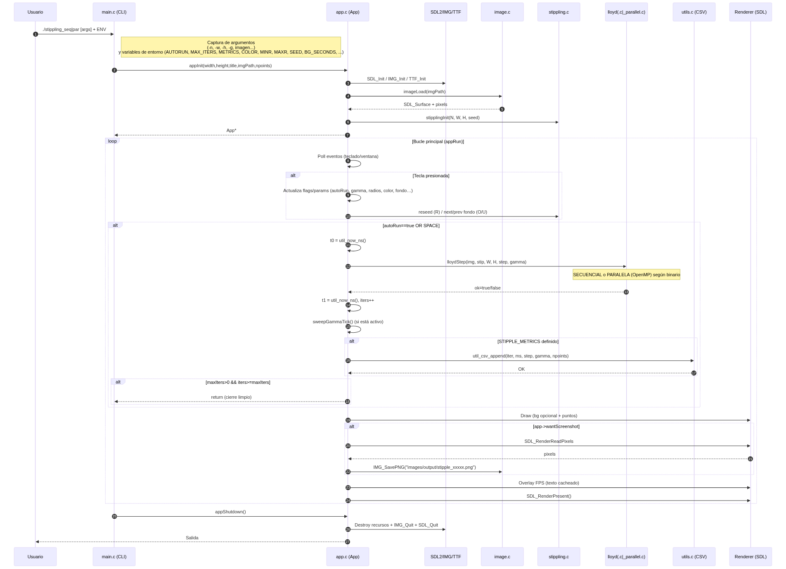

## Diagrama de flujo

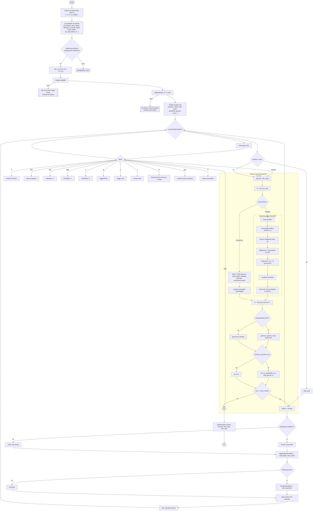

# API de headers – Documentación técnica

## Rol por módulo

- **app**: orquesta el ciclo de vida, entrada, timing, logging y render.
- **image**: I/O de imagen y muestreo bilineal (color/intensidad).
- **stippling**: almacenamiento de la nube y render estilizado.
- **lloyd**: núcleo de Lloyd (CVD); calcula centroides ponderados y actualiza puntos.
- **voronoi**: índice espacial (grilla) para NN rápido; fallback a O(N).
- **utils**: tiempos de alta resolución y utilitario CSV.

## app.h — Ciclo de vida y fondos

### `typedef struct App App;`

- **Entradas/Salidas**:
- **Descripción**: tipo opaco que encapsula el estado global de la app (ventana, renderer, imagen, nube de puntos, UI, etc.).

### `bool appInit(App **outApp, int width, int height, const char *title, const char *imagePath, int npoints);`

- **Entradas**:

  - `outApp` (`App**`): salida por referencia.
  - `width, height` (`int`): tamaño ventana (usa defaults si <=0).
  - `title` (`const char*`): título ventana (usa default si `NULL`).
  - `imagePath` (`const char*`): ruta de imagen (usa default si `NULL`).
  - `npoints` (`int`): número inicial de puntos (usa default si <=0).
- **Salidas**: `true/false` éxito.
- **Descripción**: inicializa SDL/SDL_image/TTF, crea ventana/renderer, carga imagen y siembra la nube de puntos.

### `void appRun(App *app);`

- **Entradas**: `app` (`App*`).
- **Salidas**:
- **Descripción**: bucle principal; procesa eventos, ejecuta Lloyd (manual/auto), renderiza y registra métricas si está habilitado.

### `void appShutdown(App *app);`

- **Entradas**: `app` (`App*`).
- **Salidas**:
- **Descripción**: libera recursos (texturas, fuentes, imagen, nube de puntos) y cierra subsistemas.

### Fondos (rotación)

- `bool appSetBackgroundList(App *app, int count, const char *const *paths);`
  - **In**: `app`, `count`, `paths[]`.
  - **Out**: `true/false`.
  - **Desc.**: define lista de fondos y carga el primero.
- `void appNextBackground(App *app);` / `void appPrevBackground(App *app);`
  - **In**: `app`.
  - **Out**:
  - **Desc.**: avanza/retrocede en la lista circular y carga.

## config.h — Defaults de ejecución

### Constantes principales

- `defaultWidth`, `defaultHeight` (`int`): tamaño inicial ventana.
- `defaultTitle` (`const char[]`): título por defecto.
- `defaultImagePath` (`const char[]`) y `defaultBgPaths[]` + `defaultBgCount`: imagen por defecto y lista rotatoria.
- `defaultNPoints` (`int`): número inicial de puntos.
- `defaultGamma` (`float`): gamma del peso.
- `defaultLloydStep` (`int`): stride de muestreo del lienzo.
  **Uso**: proveen valores por defecto si no se especifican por CLI/entorno.

## image.h — Carga y muestreo de imagen

### `typedef struct Image { SDL_Surface *surface; int width, height; uint32_t *pixels; } Image;`

- **Descripción**: envoltorio para `SDL_Surface` + acceso directo a pixeles RGBA.

### `bool imageLoad(Image *img, const char *path);`

- **In**: `img`, `path`.
- **Out**: `true/false`.
- **Desc.**: carga PNG/JPG, garantiza formato RGBA y rellena metadatos.

### `void imageFree(Image *img);`

- **In**: `img`.
- **Out**:
- **Desc.**: libera `SDL_Surface` y limpia campos.

### `uint32_t imageSampleBilinear(const Image *img, float u, float v);`

- **In**: `img`, coords normalizadas `u,v` \[0..1].
- **Out**: `RGBA` empaquetado.
- **Desc.**: muestreo bilineal de color.

### `float sampleIntensityBilinearUV(const Image *img, float u, float v);`

- **In**: `img`, `u,v`.
-**Out**: luminancia \[0..1].
- **Desc.**: muestreo bilineal de intensidad (rec.709).

### `SDL_Texture *imageCreateTexture(SDL_Renderer *ren, const Image *img);`

- **In**: `ren`, `img`.
- **Out**: `SDL_Texture*` (o `NULL`).
- **Desc.**: crea textura renderizable desde `Image`.

## stippling.h — Nube de puntos y render

### Estructuras

- `struct StipplePoint { float x,y; uint8_t r,g,b,a; };`
  
  **Desc.**: punto con posición y color/alpha.

- `typedef struct { struct StipplePoint *pts; int count; float *accumW; } Stippling;`
  
  **Desc.**: contenedor de puntos; `accumW` acumula pesos por punto.

### Funciones

- `bool stipplingInit(Stippling *s, int count, int W, int H, unsigned seed);`
  - **In**: `s`, `count`, `W,H`, `seed`.
  - **Out**: `true/false`.
  - **Desc.**: reserva y siembra puntos iniciales en el canvas.
- `void stipplingFree(Stippling *s);`
  - **In**: `s`.
  - **Out**:
  - **Desc.**: libera buffers asociados.
- `void stipplingRenderStyled(const Stippling *s, SDL_Renderer *ren, int W, int H, const Image *img, float minRadius, float maxRadius, bool colorPoints, bool invertTheme);`
  - **In**: `s`, `ren`, `W,H`, `img`, `minRadius`, `maxRadius`, `colorPoints`, `invertTheme`.
  - **Out**:
  - **Desc.**: dibuja la nube (puntillismo) con radio por intensidad/color y tema visual.

## lloyd.h — Iteración de Lloyd + utilidades RNG

### Utilidades RNG

- `static inline unsigned lcg(unsigned *st);`
  - **In**: `st` (estado).
  - **Out**: nuevo estado (32b).
  - **Desc.**: generador congruencial lineal rápido (no cripto).
- `static inline int irand_range(unsigned *st, int hi);`
  - **In**: `st`, `hi>0`.
  - **Out**: entero `[0,hi)`.
  - **Desc.**: pseudo-aleatorio uniforme approx. por módulo.

### Lloyd

- `bool lloydStep(const Image *img, Stippling *s, int W, int H, int step, float gamma);`
  - **In**: `img` (campo de densidad), `s` (puntos), `W,H` (canvas), `step>=1` (stride), `gamma` (exponente).
  - **Out**: `true/false` éxito.
  - **Desc.**: una iteración de Lloyd (Centroidal Voronoi); para cada muestra (cada `step` px) acumula centroide ponderado por luminancia y actualiza cada punto al centro de masa; maneja huérfanos con re-seed.

## voronoi.h — Índice espacial (grid uniforme)

### Tipos

- `typedef struct UniformGrid { ... } UniformGrid;` – grilla 2D con celdas y listas de índices.
- `typedef struct GridEntry { int pindex; int pad; } GridEntry;` – elemento por celda.

### Funciones

- `bool gridBuild(UniformGrid *g, int W, int H, int cell, const Stippling *s);`
  - **In**: `g`, dimensiones `W,H`, tamaño de celda `cell`, puntos `s`.
  - **Out**: `true/false`.
  - **Desc.**: construye índice uniforme para acelerar NN.
- `int gridNearest(const UniformGrid *g, const Stippling *s, float x, float y, int maxRing);`
  - **In**: `g`, `s`, posición `(x,y)`, anillos `maxRing`.
  - **Out**: índice de punto más cercano o `<0` si no hay.
  - **Desc.**: búsqueda de vecino más cercano explorando celdas por anillos.
- `void gridFree(UniformGrid *g);`
  - **In**: `g`.
  - **Out**:
  - **Desc.**: libera memoria del índice.

## utils.h — Tiempos y CSV

### `uint64_t util_now_ns(void);`

- **Entradas**:
- **Salidas**: `nanosegundos` desde reloj de alto-resolución.
- **Descripción**: timestamp monotónico para medir iteraciones.

### `double util_ns_to_ms(uint64_t ns);`

- **Entradas**: `ns` (nanosegundos).
- **Salidas**: `ms` (double).
- **Descripción**: conversión de unidades.

### `void util_csv_append(const char *path, const char *header, const char *rowfmt, ...);`

- **Entradas**: `path` (CSV), `header` (línea de encabezado), `rowfmt` (formato de fila) + varargs.
- **Salidas**:
- **Descripción**: crea/abre CSV y **apendea** una fila; escribe `header` solo si el archivo no existe o está vacío.

# `app.c` — Documentación técnica

## Rol del módulo

`app.c` orquesta la vida de la app **Voronoi Stippling**: inicializa subsistemas (SDL/SDL_image/TTF), crea ventana/renderer, carga fondos, prepara la nube de puntos, ejecuta el bucle principal (eventos -> simulación -> render), muestra métricas y libera recursos al salir. El tipo `App` es **opaco** fuera de `app.c` y concentra todo el estado de ejecución (ventana, renderer, imagen, puntos, timers, UI, logging, etc.).

> Vida útil: los recursos viven entre `appInit(..)` y `appShutdown(..)`; el `struct App` contiene ventana/renderer, imagen/texture, nube de puntos, timers/FPS, opciones visuales, batch/logging y rotación de fondos.

## Flujo de alto nivel

- **appInit** -> **appRun** -> **appShutdown**.
   En `appRun`: por frame hace **entrada** (SDL events), **simulación** (Lloyd manual o auto, con timing/CSV y sweep de gamma si procede) y **render** (fondo + puntos + overlay + captura).

**Teclas** (resumen): `ESC`, `SPACE`, `A`, `G/H`, `B`, `Z/X`, `N/M`, `,/.`, `C`, `I`, `R`, `P`, `O/U`. El módulo imprime esta ayuda al iniciar.

## Convenciones

- **Hilo principal**: todas las funciones de `app` se invocan desde el **main thread**.
- **Defensivo**: comprobaciones de error ante fallos de creación de ventana/renderer, `IMG_Init`, etc., con liberación ordenada antes de devolver `false`.
- **Idempotencia de cierre**: `appShutdown(NULL)` no falla; además hace `free/destroy` condicionales y cierra subsistemas en orden.
- **Batch/Métricas**: si `metricsPath` está definido, cada iteración registra `iter,ms,step,gamma,npoints` (CSV, con encabezado).
- **Overlay y título**: título/overlay se refrescan \~cada 0.25s con `FPS`, `iters`, `step`, `gamma`, radios, y flags `[COLOR]/[INVERT]`.
- **Screenshots**: la captura se realiza **al final del frame** si `wantScreenshot` está activo.
- **Fondos**: se mantiene una lista circular de rutas y se cargan con `appSetBackgroundList`/`appNextBackground`/`appPrevBackground`.

## Funciones públicas (expuestas en `app.h`)

### `bool appInit(App **outApp, int width, int height, const char *title, const char *imagePath, int npoints);`

- **Entradas:**
  `outApp: App**` (salida por referencia) - `width,height: int` (<=0 usa defaults) + `title: const char*` (NULL -> default) + `imagePath: const char*` (NULL -> default) + `npoints: int` (<=0 -> default).
- **Salidas:**
  `bool` – `true` si inicializó todo correctamente.
- **Descripción:**
  Inicializa `SDL`/`SDL_image`/`TTF`, crea ventana/renderer VSYNC, prepara directorios, carga lista de fondos (o la imagen pasada), inicializa la nube de puntos y la UI (fuente/overlay). Imprime ayuda de teclas. Maneja errores liberando recursos y retornando `false`.

### `void appRun(App *app);`

- **Entradas:**
  `app: App*` (instancia válida).
- **Salidas:** (bloquea hasta salir).
- **Descripción:**
  Bucle principal: procesa eventos (`SDL_QUIT`, `SDL_KEYDOWN`), ejecuta **Lloyd** en modo **manual** (`SPACE`) o **auto** (si `autoRun`), mide tiempos y registra CSV si está activo, aplica **sweep de gamma** según configuración y renderiza (fondo sólido/imagen, puntos estilizados, overlay y captura diferida). Refresca título/overlay cada \~0.25s.

### `void appShutdown(App *app);`

- **Entradas:**
  `app: App*` (se permite `NULL`).
- **Salidas:**
- **Descripción:**
  Libera nube de puntos y texturas, destruye renderer/ventana, cierra `TTF`, `IMG_Quit`, `SDL_Quit`, libera lista de fondos y el `App`. Idempotente ante punteros internos `NULL`.

### **Fondos**

- `bool appSetBackgroundList(App *app, int count, const char *const *paths);`
  - **In**: `app`, `count>0`, `paths[]`
  - **Out**: `bool`
  - **Desc.** Duplica y guarda la lista (propiedad pasa a `App`) y carga el primer fondo.
- `void appNextBackground(App *app);` - `void appPrevBackground(App *app);`
  - **In**: `app`
  - **Out**:
  - **Desc.** Avanza/retrocede circularmente y **carga** el fondo.

## Helpers **internos** (estáticos en `app.c`)

- `static void refreshFpsOverlay(App *app);`
  - **In**: `app`
  - **Out**:
  - **Desc.** Regenera el texto del overlay (FPS/it/step/gamma) y cachea textura; llamado \~cada 0.25 s.

- `static void drawFpsOverlay(App *app);`
  - **In**: `app`
  - **Out**:
  - **Desc.** Dibuja un recuadro semitransparente y la textura cacheada del overlay.

- `static void ensureDir(const char *path);`
  - **In**: `path`
  - **Out**:
  - **Desc.** Crea el directorio si no existe (defensivo).

- `static bool loadBackground(App *app, const char *path);`
  - **In**: `app`, `path`
  - **Out**: `bool`
  - **Desc.** Carga imagen (PNG/JPG), crea `SDL_Texture` y reemplaza la anterior.

- `static void updateFpsTitle(App *app);`
  - **In**: `app`
  - **Out**:
  - **Desc.** Formatea el **título** de la ventana con `FPS`, `it`, `step`, `gamma`, radio y flags de visual.

- `static void sweepGammaTick(App *app);`
  - **In**: `app`
  - **Out**:
  - **Desc.** Si el barrido está activo, ajusta `gammaW` cada `gEvery` iteraciones en dirección a `gEnd`.

- `static bool saveScreenshot(App *app);`
  - **In**: `app`
  - **Out**: `bool`
  - **Desc.** Lee el backbuffer y guarda `PNG` con nombre `images/output/stipple_%05d.png` (iteración actual). Se invoca al **final** del frame.

## Interacción con otros módulos

- **`image.*`**: carga PNG/JPG y muestreo bilineal de color/ luminancia.
- **`stippling.*`**: estructura de puntos y render "estilizado" (radios por intensidad/color).
- **`lloyd.*` / `voronoi.*`**: paso de Lloyd (centroidal Voronoi) y búsqueda de vecino más cercano con **UniformGrid**. En builds paralelos, la paralelización vive aquí; `app.c` permanece en el hilo principal.

## Despliegue de resultados

- **Overlay** (FPS/estado) y **título** informativo, actualizados \~cada 0.25 s.
- **Screenshots** en `images/output/` cuando se pulsa `P` (captura diferida al final del frame).

## Variables de entorno relevantes (soportadas por `app.c`)

- `STIPPLE_AUTORUN=1|0` -> auto-iterar Lloyd por frame.
- `STIPPLE_MAX_ITERS=K` -> modo batch: salir al llegar a `K` iteraciones (log si `STIPPLE_METRICS`).
- `STIPPLE_METRICS=path.csv` -> CSV por iteración: `iter,ms,step,gamma,npoints`.
- **Barrido de gamma**: `STIPPLE_GAMMA_START`, `STIPPLE_GAMMA_END`, `STIPPLE_GAMMA_STEP`, `STIPPLE_GAMMA_EVERY` (activa cuando hay `END` y `STEP`).

## Glosario mínimo del estado `App`

- **Tiempo/FPS**: `freq`, `last`, `accTime`, `frames`, `fpsAvg`, `lastUiUpdate`.
- **Recursos**: `image`, `imageTex`, `stip`.
- **Visual**: `showBg`, `colorPoints`, `invertTheme`, `minRadius`, `maxRadius`, `dotRadius`.
- **Lloyd**: `autoRun`, `iters`, `pixelStride`, `gammaW`, `seed`.
- **Batch**: `maxIters`, `metricsPath`, `sweepGamma{gStart,gEnd,gStep,gEvery}`.
- **UI**: `font`, `fpsTex`, `fpsTexW/H`.
- **Fondos**: `bgPaths`, `bgCount`, `bgIndex`, `bgTimer`, `bgPeriod`.

# `image.c` — Documentación técnica

## Rol del módulo

Proveer una **capa delgada y segura** para: (1) cargar una imagen desde disco, (2) convertirla a un formato homogéneo `RGBA32`, (3) **precomputar luminancia lineal** (`img->luma`) y (4) exponer **muestras** de intensidad/color con versiones **nearest** y **bilineal**.

## Flujo interno

1. **Carga**

   - `imageLoad(img, path)` valida punteros, hace `IMG_Load`, convierte a `SDL_PIXELFORMAT_RGBA32`, rellena campos (`w,h,pixels,pitchPixels`) y dispara `imageBuildLuma(img)`. En error, limpia y **loggea** en `stderr`.

2. **Precálculo de luma**

   - `imageBuildLuma(img)` recorre filas/columnas, extrae `R,G,B` (vía `SDL_GetRGBA`), convierte **sRGB->lineal** y calcula **luma Rec.709** por píxel; guarda en `img->luma`. (Escalable por filas; sin sincronización compartida).

3. **Muestreo**

   - **Nearest:** `sampleIntensity(img,x,y)` usa `pitchPixels`, desempaqueta canales con `SDL_GetRGBA` y calcula luma **en sRGB normalizado** (rápido).
   - **Bilineal (luma):** `sampleIntensityBilinearUV(img,u,v)` **clamp**, mapea `(u,v)->(x,y)`, toma 4 vecinos y **mezcla en dominio lineal** (si hay `img->luma`, usa la tabla).
   - **Bilineal (color):** `sampleRgbBilinearUV(img,u,v, r,g,b)` interpola canales **sRGB** para tintar puntos.

4. **Liberación**

   - `imageFree(img)` libera la `SDL_Surface` y deja la estructura en estado neutro (**idempotente**).

## Convenciones

- **Formato**: siempre `SDL_PIXELFORMAT_RGBA32`; `pixels = (Uint32*)surface->pixels`; `pitchPixels = surface->pitch / 4`.
- **Coordenadas**: `(x,y)` en píxel entero; `(u,v)` **normalizados** \[0..1] (se hace **clamp** interno).
- **Luma**: **Rec.709** en \[0..1]; **nearest** la computa en sRGB, **bilineal** la interpola en **lineal** (evita artefactos por gamma).
- **Portabilidad**: extracción de canales con `SDL_GetRGBA` (independiente de endian/layout).
- **Defensivo**: validaciones de punteros/rangos y `clamp` a \[0..1] en bilineal. Retornos nulos ante entradas inválidas.

**Paralelo/sincronía**: `imageBuildLuma` es **embarrassingly parallel** por filas; no requiere sincronización si se paraleliza externamente (cada hilo escribe su fila). El módulo no introduce primitivas de sincronía propias.

## Tipo principal

```c
typedef struct {
  int w, h;            // dimensiones px
  int pitchPixels;     // pitch/4 en RGBA32
  Uint32 *pixels;      // buffer RGBA8888 (alias de surface->pixels)
  SDL_Surface *surface;
  float *luma;         // luminancia lineal precomputada (w*h)
} Image;
```

## `bool imageLoad(Image *img, const char *path);`

- **Entradas**: `img` (salida no inicializada), `path` (ruta).
- **Salidas**: `true/false`. En éxito, llena `w,h,pixels,pitchPixels,surface` y **construye `luma`**.
- **Descripción**: carga vía `SDL_image`, convierte a `RGBA32`, deja el objeto listo para muestreos; limpia y reporta en error.

## `void imageBuildLuma(Image *img);`

- **Entradas**: `img` válido con `pixels`/`surface`.
- **Salidas**: — (efecto: `img->luma = w*h` en **lineal**).
- **Descripción**: recorre la imagen, hace `sRGB->lineal` canal por canal y calcula luma Rec.709 en un buffer contiguo para **muestreo bilineal rápido/fiel**. Escalable por filas.

## `void imageFree(Image *img);`

- **Entradas**: `img` (se permite `NULL`).
- **Salidas**: —.
- **Descripción**: libera la `SDL_Surface` y pone `w=h=pitchPixels=0`, `pixels=surface=luma=NULL`. **Segura e idempotente**.

## `float sampleIntensity(const Image *img, int x, int y);`

- **Entradas**: `img`, `x,y` en rango.
- **Salidas**: `luma_srgb` en \[0..1] (0.0 si inválido).
- **Descripción**: muestreo **nearest** de luma Rec.709 a partir de `RGBA32` usando `SDL_GetRGBA` y pesos Rec.709 **en sRGB**. Muy rápido; para **interpolación fiel** usa la versión bilineal.

## `float sampleIntensityBilinearUV(const Image *img, float u, float v);`

- **Entradas**: `img`, `u,v` normalizados (se hace **clamp** interno).
- **Salidas**: `luma_lineal` en \[0..1] (0.0 si inválido).
- **Descripción**: mapea `(u,v)` -> `(x,y)`, toma los 4 vecinos y **mezcla en lineal**. Si existe `img->luma`, la usa directamente (menos conversiones).

## `void sampleRgbBilinearUV(const Image *img, float u, float v, Uint8 *r, Uint8 *g, Uint8 *b);`

- **Entradas**: `img`, `u,v`, punteros `r,g,b`.
- **Salidas**: `r,g,b ∈ [0..255]` (0s si inválido).
- **Descripción**: muestreo **bilineal** por canal en **sRGB** (rápido y suficiente para colorear puntos).

## Notas de programación defensiva

- Validación de **punteros/rangos** en `imageLoad`, `sampleIntensity`, `sampleIntensityBilinearUV`.  
- **Clamp** de `(u,v)` a \[0..1] en bilineal.
- Extracción de canales con `SDL_GetRGBA` (portátil, evita asumir desplazamientos).

# `stippling.c` — Documentación técnica

## Rol del módulo

Gestiona la **nube de puntos** del puntillismo: creación inicial (siembra pseudoaleatoria en el lienzo) y **render estilizado** (radio por brillo e, opcionalmente, color muestreado de la imagen). La siembra y el render están pensados para alimentar el **algoritmo de Lloyd** y mostrar el resultado en **SDL2**.

## Flujo (resumen)

1. **Siembra inicial** (`stipplingInit`): reserva memoria y ubica `n` puntos uniformes en `[0..W)×[0..H)`.
   - *Secuencial:* LCG 32-bit;
   - *Paralelo:* *xorshift32* con mezcla determinista por índice/hilo.
2. **Render** (`stipplingRenderStyled`): por cada punto, calcula UV -> muestrea **luminancia** y (si se pide) **color** de la imagen, calcula radio `r∈[minR,maxR]` y rasteriza un disco mediante scanlines. Debe ejecutarse en el **hilo principal** (SDL no es thread-safe para render).

## Convenciones

- **Rangos y contratos**

  - `n > 0`, `W > 0`, `H > 0`; en caso contrario, `stipplingInit` retorna `false`.
  - `minR` se clampa internamente a `>=0.5`; `maxR` se clampa a `>=minR`.
- **Determinismo**

  - Misma **semilla** + mismos **parámetros** => misma nube inicial.
  - En OMP, cada punto usa estado RNG **independiente** (mezcla de `seed` + `i`), evitando corridas no deterministas.
- **Paralelismo y sincronía**

  - *Init (OMP):* `#pragma omp parallel for schedule(static)`; no hay reducciones ni locks (cada hilo escribe índices disjuntos).
  - *Render:* llámese **solo** desde el hilo principal (SDL).
- **Errores/defensiva**

  - Si `malloc` falla, no se altera el estado previo; `stipplingFree` es **idempotente** (segura ante múltiples llamadas).

## Estructuras expuestas (resumen)

> Las definiciones completas viven en `stippling.h`. A partir de las *units* de implementación:
>
> - `Dot { float x, y; }` (posición)
> - `Stippling { Dot *pts; int count, width, height; }` (conjunto y metadatos)

## `bool stipplingInit(Stippling *s, int n, int w, int h, unsigned seed);`

**Entradas:**

- `s` (`Stippling*`): salida a inicializar (no `NULL`).
- `n` (`int`): cantidad de puntos (`>0`).
- `w, h` (`int`): dimensiones del canvas (`>0`).
- `seed` (`unsigned`): semilla RNG (si `0`, la impl. usa un default interno).

**Salidas:**

- `bool`: `true` si reserva e inicializa; `false` si parámetros inválidos o `malloc` falla.

**Descripción:**

- Reserva `n` puntos y los ubica **uniformemente** en el rectángulo `[0..w)×[0..h)`.
- **Secuencial:** usa **LCG** (Numerical Recipes: `state = state*1664525 + 1013904223`) y normaliza con 24 bits altos.
- **Paralelo (OMP):** `#pragma omp parallel for`, RNG **xorshift32** por punto con semilla mezclada por índice (`0x9E3779B9 ^ seed ^ i*0x85EBCA6B`). Sin sincronización.

## `void stipplingFree(Stippling *s);`

**Entradas:**

- `s` (`Stippling*`): estructura a limpiar (puede ser `NULL`).

**Salidas:**

**Descripción:**

- Libera `s->pts` (si existe) y pone `pts=NULL`, `count=width=height=0`.
- **Idempotente** y segura ante `NULL`.

## `void stipplingRenderStyled(const Stippling *s, SDL_Renderer *ren, int canvasW, int canvasH, const Image *img, float minR, float maxR, bool useColor, bool invertTheme);`

**Entradas:**

- `s` (`const Stippling*`): nube de puntos (no `NULL`, `s->pts` válido).
- `ren` (`SDL_Renderer*`): destino (hilo principal).
- `canvasW, canvasH` (`int`): dimensiones del canvas (>=1).
- `img` (`const Image*`): imagen de referencia (opcional).
- `minR, maxR` (`float`): radios mínimo/máximo (clamp interno).
- `useColor` (`bool`): si `true`, pinta con color de la imagen; si `false`, usa color base tema.
- `invertTheme` (`bool`): tema claro/oscuro para color base.

**Salidas:**

**Descripción:**

- Convierte `(x,y)` de cada punto a `uv` normalizado; muestrea **luminancia** (y **RGB** si `useColor`) por bilineal; calcula `radius = lerp(minR,maxR, 1 - lum)`; rasteriza el disco con **scanlines** (`SDL_RenderDrawLine`).
- Si no hay imagen, `lum=0` -> `radius≈maxR`. El alfa baja ligeramente si `useColor` para suavizar.

## Diferencias clave: secuencial vs paralelo

| Aspecto      | Secuencial                                                  | Paralelo (OpenMP)                                                                 |
| ------------ | ----------------------------------------------------------- | --------------------------------------------------------------------------------- |
| RNG          | **LCG** 32-bit (`1664525`, `1013904223`), normaliza 24 bits | **xorshift32** por punto, semilla mezclada con índice; `#pragma omp parallel for` |
| Sincronía    | No aplica                                                   | No se requiere (índices disjuntos)                                                |
| Determinismo | Sí (misma semilla -> misma nube)                             | Sí (mezcla determinista por `seed`+`i`)                                           |

# `lloyd.c` — Documentación técnica

## Rol del módulo

Ejecuta **una iteración** del algoritmo de Lloyd (Centroidal Voronoi) para *Voronoi Stippling*: mueve cada punto al **centro de masa ponderado por la imagen** (luminancia). La API pública expuesta en `lloyd.h` es `lloydStep(...)`.

**Modo de peso (compile-time):**

- `STIPPLE_WEIGHT_BY_BRIGHTNESS=1` -> `w = (lum)^gamma` (favorece zonas **claras**).
- `STIPPLE_WEIGHT_BY_BRIGHTNESS=0` -> `w = (1 - lum)^gamma` (favorece **oscuras**).&#x20;

La luminancia proviene de muestreo **bilineal** en UV con conversión sRGB->lineal usando Rec.709.&#x20;

## Convenciones del módulo

- Coordenadas en píxel (origen arriba-izquierda), rangos válidos `x∈[0,w)`, `y∈[0,h)`.&#x20;
- `pixelStride >= 1` controla granularidad/costo de muestreo; mayor = más rápido/menos preciso.&#x20;
- La implementación **modifica** `Stippling` *in-place* y por sí sola no es thread-safe; la versión paralela usa OpenMP con acumuladores por hilo y reducción.

## Flujo (secuencial)

1. **Validación** de entradas (`img`, `s`, dimensiones, `step`).&#x20;
2. **Construcción de grilla uniforme** (`UniformGrid`, `cell=32`) para acelerar *nearest neighbor*.&#x20;
3. **Acumuladores** por punto `sumX/sumY/sumW` en `double`.&#x20;
4. **Barrido** del lienzo cada `step`:

   - `(x,y)->(u,v)` centrado del píxel, muestrear `lum` (bilineal).
   - Calcular `w` con el modo activo (`lum^gamma` o `(1-lum)^gamma`).
   - NN con grilla; si falla, **fallback O(N)**.
   - Acumular `(x*w, y*w, w)` en el punto ganador.&#x20;
5. **Actualizar** puntos con su centroide si `sumW>0`.&#x20;
6. **Reseed de huérfanos** (`sumW==0`): hasta 64 intentos en zonas con `w>1e-6`.&#x20;

**Complejidad aprox.**
`O((W/step * H/step) * k)`; `k` = puntos inspeccionados por la grilla.&#x20;

## Flujo (paralelo con OpenMP)

La API es la **misma** (`lloydStep`); la implementación usa:

- **Buffers locales por hilo** `sumXlocal/sumYlocal/sumWlocal` (tamaño `T×N`) para evitar carreras.
- Un `#pragma omp for collapse(2)` sobre el doble bucle `y/x`.
- **Reducción manual**: sumar locales -> globales.

Búsqueda NN con grilla (`ringMax=2`), con fallback O(N) si no hay candidatos, igual que en la versión secuencial.&#x20;

Luego:

- **Actualización** de puntos para `sumW>0`.
- **Reseed** determinista de huérfanos (semilla derivada de `n^W^H + 0x9E3779B9`, hasta 64 intentos).
- **Liberación** de buffers y grilla.

## Mecanismos de sincronía

- Paralelismo de *loop-level* (OpenMP).
- Evita *atomics* en el inner loop: **acumulación privada** por hilo y **reducción** posterior -> sin contención.&#x20;

## Programación defensiva / robustez

- Chequeos de punteros, dimensiones y `step`.
- Fallback a O(N) si la grilla no devuelve candidato.
- Re-sembrado de huérfanos para evitar colapsos de celdas vacías.

## Despliegue de resultados

Este módulo **no renderiza**; solo actualiza `s->pts[i].(x,y)`. El render ocurre en `stipplingRenderStyled(...)` desde `stippling.c`.&#x20;

### `bool lloydStep(const Image *img, Stippling *s, int w, int h, int pixelStride, float gamma);`

- **Entradas**

  - `img` (`const Image*`): fuente de luminancia Rec.709 en `[0..1]` (UV bilineal, sRGB->lineal).
  - `s` (`Stippling*`): nube de puntos (modificada in-place).
  - `w,h` (`int`): dimensiones del lienzo (px).
  - `pixelStride` (`int`): salto de muestreo (`k>=1`).
  - `gamma` (`float`): exponente del peso (`lum^gamma` o `(1-lum)^gamma` según macro).&#x20;
- **Salidas**

  - `bool`: `true` si la iteración completó; `false` si entradas inválidas o error.&#x20;
- **Descripción (funcionamiento)**
  Muestrea el lienzo cada `pixelStride`, asigna cada muestra a su punto más cercano (grilla uniforme + fallback), acumula centroide ponderado por `w` y actualiza cada punto a su centro de masa. Maneja puntos **huérfanos** mediante re-sembrado probabilístico en zonas con peso. Coste aprox. `O((W/stride * H/stride) * k)`.

**Pre/Postcondiciones resumidas (del header):**
`img!=NULL`, `s!=NULL`, `s->count>0`, `w,h>0`, `pixelStride>=1`; al finalizar, los puntos se reubican hacia sus centroides ponderados.&#x20;

## Notas de implementación

- RNG ligero (LCG) + `irand_range` para re-seed; determinista a igualdad de semilla. *(Detalles en `lloyd.c`/`lloyd_parallel.c`)*.

# `voronoi.c` — Documentación técnica

## Rol del módulo

Este módulo provee un **índice espacial 2D** liviano para acelerar el vecino más cercano (NN) durante una iteración de **Lloyd**. Divide el canvas en **celdas fijas** y, por celda, mantiene los índices de puntos. Hay **dos backends**:

1. **Secuencial (lista por celda)**: `head[]` y `next[]` (lista enlazada implícita). Flujo simple y cache-friendly para N y W×H moderados.
2. **Paralelo (CSR + OpenMP)**: `cellCount`, `cellOffset`, `cellPoints` con compactación **contigua por celda**; bucles `omp parallel for` y vectorización `omp simd` en el recorrido de candidatos. Ideal para **muchos puntos** y **muchas celdas**.

## Flujo interno

### A. Secuencial (listas por celda)

1. **Construcción (`gridBuild`)**

   - Calcula `cols`, `rows` y reserva `head[cols*rows] = -1` y `next[N]`.
   - Para cada punto *i*, obtiene `(cx,cy)`, calcula `hidx` y hace **push-front** en `head[hidx]` con `next[i]=head[hidx]`.
2. **Búsqueda (`gridNearest`)**

   - Toma la **celda base** de `(x,y)` y explora por **anillos** `r=0..ringMax`.
   - Solo recorre el **borde** del anillo; compara distancias **al cuadrado** y aplica **corte temprano** si ya hubo candidato con `r>=1`.
3. **Liberación (`gridFree`)**: suelta `head/next`, pone estado neutro.

### B. Paralelo (CSR)

1. **Construcción (`gridBuildCSR_omp` vía `gridBuild`)**

   - **Conteo por celda** en paralelo con `#pragma omp parallel for` + `omp atomic`.
   - **Prefix-sum** en `cellOffset` para obtener rangos por celda.
   - **Dispersión paralela** de los índices en `cellPoints` usando contador **atómico** por celda.
2. **Búsqueda (`gridNearestCSR`)**

   - Misma estrategia de **anillos**, pero cada celda se recorre como **rango contiguo** `[offset[h]..offset[h+1])`.
   - Bucle interno con `#pragma omp simd` para **vectorización** (CPU SIMD).
3. **Liberación (`gridFreeCSR` / `gridFree`)**: libera `cellCount/cellOffset/cellPoints`.

## Convenciones

- **Coordenadas de canvas**: flotantes `(x,y)` en `[0..W)×[0..H)`.
- **Celda**: tamaño entero `cell>0`.
- **Truncamiento/clamp**: `cx=(int)x/cell`, `cy=(int)y/cell`, con **clamp** a bordes.
- **Distancias**: se compara **d²** (sin `sqrt`) para rendimiento.
- **ringMax**: `0` = solo la celda base; `1` = vecinas inmediatas; etc.
- **Defensiva**: valida punteros, tamaños >0, y **estado neutro** tras `free`.

> Las firmas públicas están en `voronoi.h`. Aquí se documenta su comportamiento según backend.

## `bool gridBuild(UniformGrid *g, int W, int H, int cell, const Stippling *s);`

- **Entradas**

  - `g` (`UniformGrid*`): salida a inicializar.
  - `W,H` (`int`): dimensiones del canvas.
  - `cell` (`int`): tamaño de celda (>0).
  - `s` (`const Stippling*`): nube de puntos válida.
- **Salidas**: `true/false`.
- **Descripción**: Construye la grilla.

  - **Secuencial**: rellena `head`/`next` con listas por celda.
  - **Paralelo**: ruta CSR (`cellCount/Offset/Points`) con OpenMP.

## `int gridNearest(const UniformGrid *g, const Stippling *s, float x, float y, int ringMax);`

- **Entradas**

  - `g` (`const UniformGrid*`): grilla construida (listas o CSR).
  - `s` (`const Stippling*`): puntos (se leen `pts[i].x/y`).
  - `x,y` (`float`): consulta.
  - `ringMax` (`int`): radio máximo de anillos.
- **Salidas**: `índice` del punto más cercano o `-1`.
- **Descripción**: Búsqueda por **anillos** con **corte temprano**.

  - **Secuencial**: recorre listas por celda.
  - **Paralelo/CSR**: recorre **rangos contiguos** y usa `omp simd`.

## `void gridFree(UniformGrid *g);`

- **Entradas**: `g` (`UniformGrid*`).
- **Salidas**:
- **Descripción**: Libera buffers internos y lleva `g` a **estado neutro**.

  - **Secuencial**: suelta `head/next`.
  - **Paralelo**: suelta `cellCount/Offset/Points`.

## Secciones paralelas y mecanismos de sincronía

- **Conteo por celda**: `#pragma omp parallel for` + `#pragma omp atomic update` al acumular `cellCount[hidx]`. Evita colisiones entre hilos cuando múltiples puntos caen en la misma celda.
- **Dispersión**: `#pragma omp atomic capture` para obtener un **slot único** por celda al escribir en `cellPoints[offset[h]+slot]`.
- **Recorrido de candidatos**: `#pragma omp simd` en el bucle interno para vectorizar el cálculo de distancias (SIMD **intra-hilo**).

## Programación defensiva

- Valida **punteros** (`g`, `s`, `s->pts`) y **rangos** (`W,H,cell>0`, `count>0`).
- En fallos de reserva, libera parcial y retorna `false`.
- `gridFree` es **idempotente** (seguro llamar varias veces).

## Despliegue de resultados

Este módulo **no dibuja**; devuelve **índices** para que el paso de Lloyd acumule centroides o el renderer pinte. Se integra en `lloyd.c / lloyd_parallel.c` como **acelerador NN**.

## Ejemplo de uso (pseudo)

```c
UniformGrid g = {0};
if (gridBuild(&g, W, H, 32, &stip)) {
    int idx = gridNearest(&g, &stip, qx, qy, 1);
    // usar idx...
}
gridFree(&g);
```

## Rendimiento y elección de backend

- **Listas por celda**: simple y rápido para tamaños modestos.
- **CSR + OpenMP**: mejor **localidad** y **paralelismo** cuando N es grande o al hacer muchas consultas NN por iteración.

# `utils.c` — Documentación técnica

## Rol del módulo

Utilidades de bajo nivel para: **asegurar directorios** (tipo `mkdir -p`), **medir tiempo monótono** (ns) y **apendear** filas a **CSV** con cabecera automática. API mínima y portable sobre POSIX/C estándar.

## Flujo (alto nivel)

1. La app solicita un **timestamp** antes/después de una sección crítica -> `util_now_ns()` -> diferencia -> `util_ns_to_ms()` para loguear ms.
2. Para **métricas**, se llama `util_csv_append(path, header, fmt, ...)`; si el archivo no existía, se **asegura el directorio** y se escribe el **header** una vez.

## Convenciones

- **Thread-safety**: seguro si cada hilo escribe **archivos distintos**; para el **mismo CSV** usa sincronización externa (no hay locking interno).
- **Errores**: funciones retornan `bool` (éxito/fallo) y no dependen de `errno` del llamador.
- **Portabilidad**: asume separador `/` y API POSIX (`mkdir`, permisos `0755`). No interpreta `\\` de Windows.

## `bool util_fs_ensure_dir(const char *path);`

- **Entradas:**
  - `path` (`const char*`): ruta de **directorio** a garantizar (no vacía).
- **Salidas:**
  - `true` si el directorio existe (ya existía o fue creado); `false` en error real.
- **Descripción**
Comprueba si `path` es un directorio; si no, intenta crearlo (recursivo) vía `mkpath`. Soporta barra final y usa permisos `0755`.

## `uint64_t util_now_ns(void);`

- **Entradas:**
- **Salidas:**
  - `uint64_t`: **nanosegundos** desde un reloj **monótono** (`CLOCK_MONOTONIC`).
- **Descripción**
Reloj de alta resolución para **medir intervalos** (no calendario). Implementado con `clock_gettime(CLOCK_MONOTONIC, ...)`.

## `double util_ns_to_ms(uint64_t ns);`

- **Entradas:**
  - `ns` (`uint64_t`): intervalo en nanosegundos.
- **Salidas:**
  - `double`: **milisegundos** (`ns / 1e6`).
- **Descripción**
Conversión directa de ns->ms para reportes de tiempo.

## `bool util_csv_append(const char *path, const char *header, const char *fmt, ...);`

- **Entradas:**
  - `path` (`const char*`): ruta del CSV.
  - `header` (`const char*`): cabecera opcional a escribir si el archivo **no existía**.
  - `fmt, ...`: formato estilo `printf` de la **fila** a apendear (recomendado terminar con `\n`).

- **Salidas:**
  - `true` en éxito; `false` si falla asegurar dir/abrir/escribir.
- **Descripción**
Abre el archivo en **append**; si el archivo no existía, escribe primero `header` (añade `\n` si falta). Antes, **extrae el directorio** (`dirname_from_path`) y llama a `util_fs_ensure_dir` para asegurarlo. **No** realiza locking concurrente.  

## Funciones internas (no exportadas)

### `static bool mkpath(const char *path);`

Crea **recursivamente** cada prefijo de `path` (estilo `mkdir -p`), ignorando `EEXIST`. Recorta barra final, usa permisos `0755`.

### `static void dirname_from_path(const char *path, char *out, size_t out_sz);`

Extrae el **directorio contenedor** de una ruta (`"a/b/c.csv"->"a/b"`, `"file.csv"->""`), asegurando terminación NUL.

## Ejemplos de uso

**Medición de tiempo:**

```c
uint64_t t0 = util_now_ns();
/* ... trabajo ... */
uint64_t t1 = util_now_ns();
double ms = util_ns_to_ms(t1 - t0);
```

**Registro de métricas:**

```c
util_csv_append("images/output/seq/metrics.csv",
                "iter,ms,step,gamma,npoints",
                "%d,%.3f,%d,%.3f,%d\n",
                it, ms, step, gamma, npoints);
```

# Bitácora de pruebas

El benchmark utilizado considera las dos partes de los archivos compilados:

- **SEQ** -> versión secuencial.
- **OMP** -> versión paralela con OpenMP.

El objetivo es medir cuánto mejora (o empeora) el rendimiento al paralelizar; para las pruebas se calculó el **speedup**, esto se define como:

$$
\text{Speedup} = \frac{T_{seq}}{T_{par}}
$$

donde:

- $T_{seq}$ = tiempo promedio de la versión secuencial.
- $T_{par}$ = tiempo promedio de la versión paralela.

- **Speedup = 1.0** -> No hay ganancia, ambas versiones tardan lo mismo.
- **Speedup > 1.0** -> La versión paralela es más rápida (hay mejora).

  - Ej: Speedup = 2.0 -> OMP es el doble de rápido que SEQ.
  - Ej: Speedup = 5.0 -> OMP es 5 veces más rápido.
- **Speedup < 1.0** -> La versión paralela es más lenta (hay overhead de paralelización).

## Benchmark bucle

### PC1 - Escritorio

| N     | Promedio ms (SEQ) | Promedio ms (OMP) | Speedup SEQ/OMP |
|-------|-------------------|-------------------|-----------------|
| 2000  | 6.598020          | 8.775120          | 0.752           |
| 4000  | 11.783380         | 12.836300         | 0.919           |
| 6000  | 17.933300         | 15.059940         | 1.194           |
| 8000  | 28.949420         | 16.253840         | 1.781           |
| 10000 | 48.921300         | 22.612800         | 2.166           |
| 12000 | 68.567910         | 21.369830         | 3.209           |
| 14000 | 82.506950         | 20.197140         | 3.942           |
| 16000 | 105.261280        | 23.017500         | 4.573           |
| 18000 | 123.027270        | 23.712520         | 5.188           |
| 20000 | 140.503360        | 26.834800         | 5.236           |

### PC2 - Laptop

| N     | Promedio ms (SEQ) | Promedio ms (OMP) | Speedup SEQ/OMP |
|-------|-------------------|-------------------|-----------------|
| 2000  | 11.660620         | 3.189670          | 3.659           |
| 4000  | 22.163180         | 4.908770          | 4.515           |
| 6000  | 31.974470         | 5.495560          | 5.818           |
| 8000  | 51.081030         | 11.178510         | 4.571           |
| 10000 | 66.904320         | 13.873110         | 4.823           |
| 12000 | 89.123800         | 20.712340         | 4.303           |
| 14000 | 119.171460        | 33.654470         | 3.542           |
| 16000 | 142.775740        | 32.417460         | 4.406           |
| 18000 | 162.633430        | 27.016560         | 6.020           |
| 20000 | 174.230730        | 29.735440         | 5.856           |

## Benchmark unitario (N = 50000)

| PC            | N     | Promedio ms (SEQ) | Promedio ms (OMP) | Speedup SEQ/OMP |
|---------------|-------|-------------------|-------------------|-----------------|
| PC escritorio | 50000 | 443.005050        | 38.483720         | 11.511          |
| Laptop        | 50000 | 823.389900        | 58.601760         | 14.051          |

## Evidencia de pruebas

### PC1 (Escritorio)

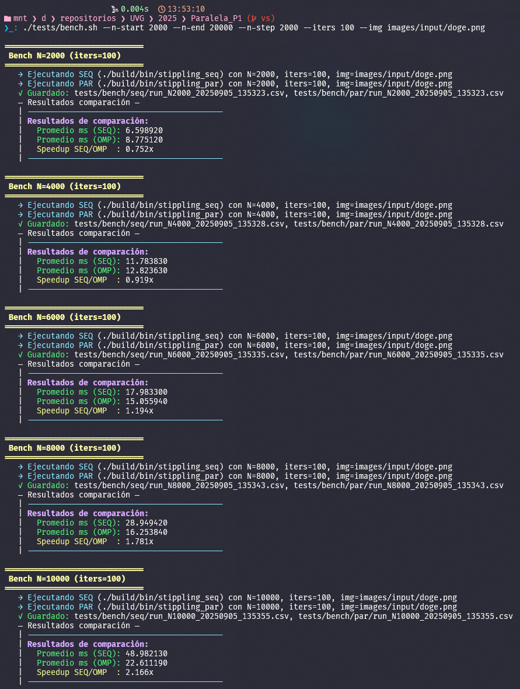

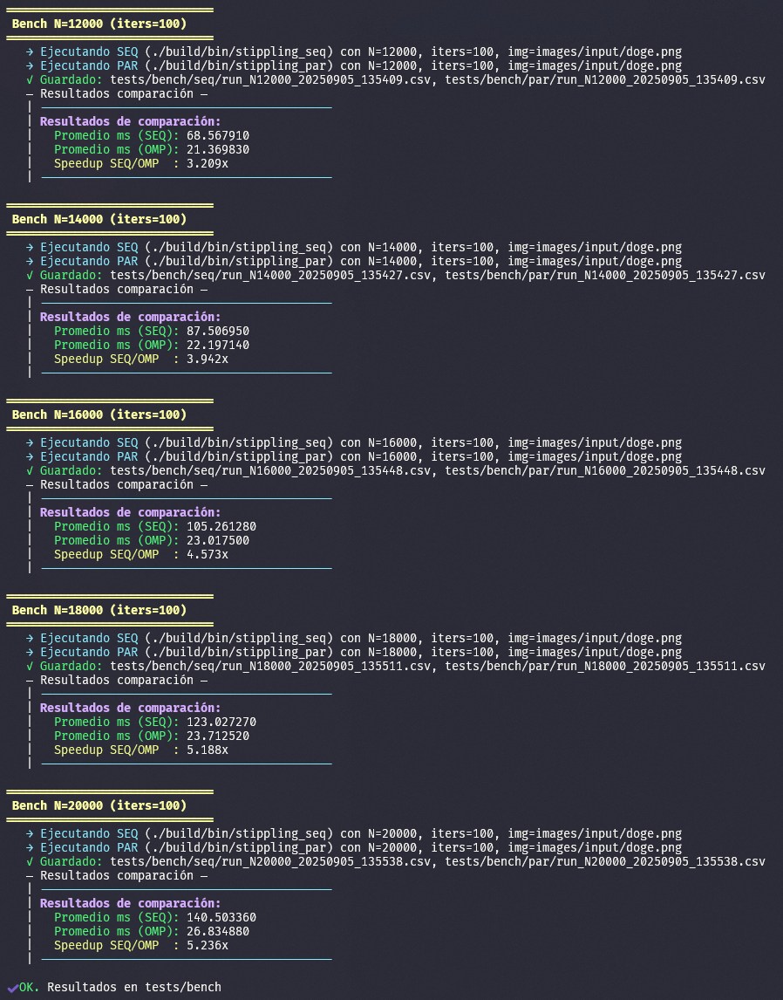

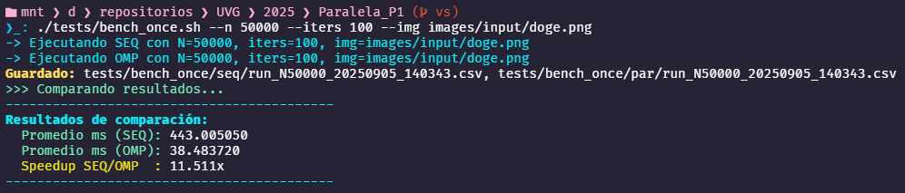

### PC2 (Laptop)

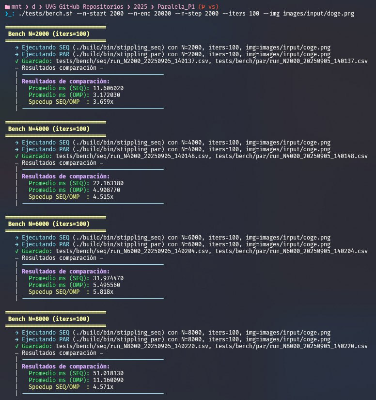

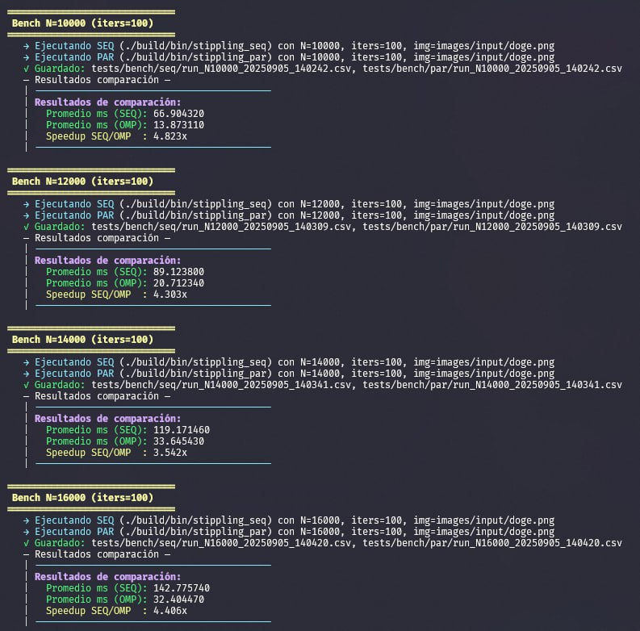

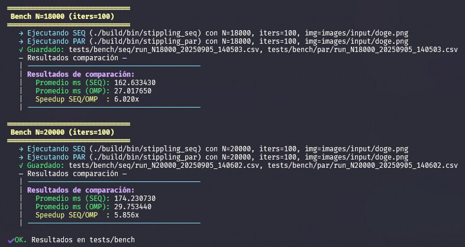

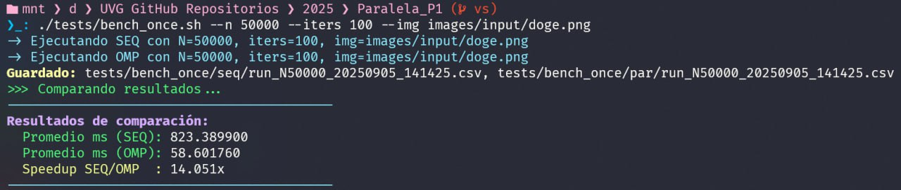

## Gráficas

### PC1 (Escritorio): Tiempos vs N

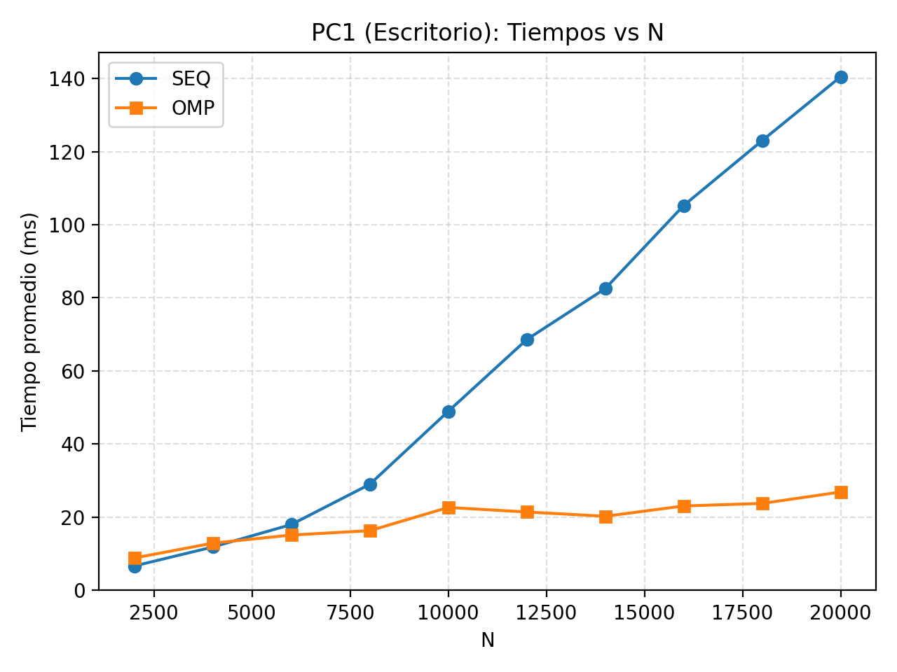

### PC2 (Laptop): Tiempos vs N

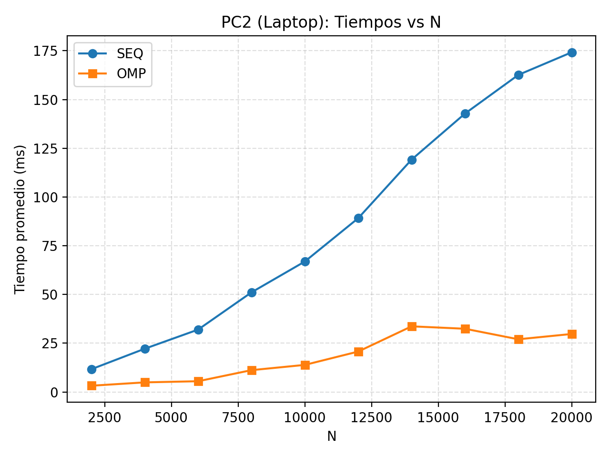

### Comparación tiempos N=50000

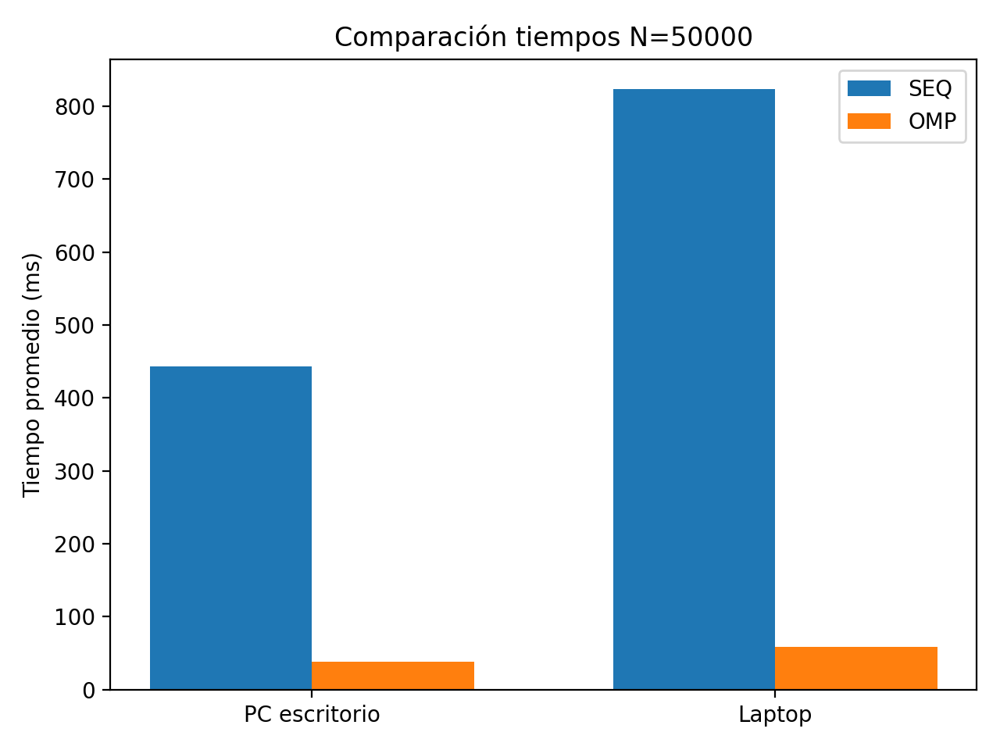

### Speedup vs N

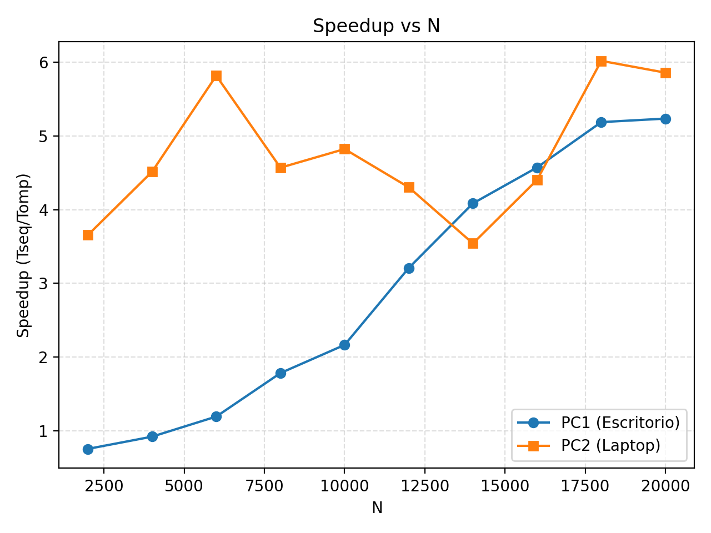

## Resultados

- En **problemas pequeños** (N bajos), la versión **OMP** en PC1 llega a ser más lenta que SEQ, debido al overhead de gestión de threads.
- A partir de **N=6000** en PC1, OMP supera claramente a SEQ y escala hasta **5.2x** en N=20000.
- En PC2 (laptop), el **speedup es mayor desde el inicio**, llegando hasta **~6x** en N=18000–20000.  
- Para **N=50000**, ambas máquinas muestran una aceleración significativa:
  - PC1 (escritorio): ~11.5x  
  - PC2 (laptop): ~14.0x  
- Esto refleja que el **algoritmo paralelo escala bien con N**, y que las diferencias de hardware impactan tanto en los tiempos absolutos como en el speedup relativo.

# Recomendaciones

- **Tamaño del problema**: usar **N ≥ 6000** en PC1 para ver ganancias; en PC2 el paralelismo rinde incluso con N bajos.
- **Hilos**: fijar `OMP_NUM_THREADS` al # de núcleos físicos y mantenerlo constante entre corridas comparables.
- **Parámetros fijos para pruebas**: semilla (`STIPPLE_SEED`), `gamma` (sin *sweep*), color ON/OFF, radios, y desactivar rotación de fondos (`STIPPLE_BG_SECONDS=0`) para reducir ruido en medición.
- **Métricas**: recolectar CSV con `STIPPLE_AUTORUN=1` y `STIPPLE_MAX_ITERS=K`; repetir 3–5 veces y promediar.
- **Warm-up**: descartar las primeras 1–2 iteraciones si hay variabilidad inicial.
- **Afinidad/ruido**: cerrar apps pesadas, usar modo “alto rendimiento” del SO y, si es posible, fijar afinidad (e.g., `taskset`) para estabilidad.
- **Explorar escalado**: barrer N y graficar *ms vs N* y *speedup vs N* para identificar la zona eficiente.

# Conclusiones

- La paralelización **no trivial** (buffers por hilo + reducción) elimina contención y habilita **aceleraciones sostenidas** en tamaños grandes.
- Existe un **punto de cruce**: con N pequeño, el *overhead* de OMP puede superar el beneficio; con N medio/alto, OMP **supera claramente** a SEQ.
- El **hardware** influye: la laptop probada obtiene speedups altos desde N bajos, mientras que el escritorio necesita N mayores para despegar.
- Con N=50000 se alcanzan speedups **>10×**, validando que la estrategia paralela es efectiva y escalable para cargas intensivas.

# Referencias

- [Esteban Hufstedler: *Modified Voronoi Diagrams and Stippling*](https://estebanhufstedler.com/2020/01/11/modfied-voronoi-diagrams-and-stippling/) (conceptos de Lloyd, Weighted, Anisotropy)
- [Mike Bostock – ObservableHQ: *Voronoi Stippling*](https://observablehq.com/@mbostock/voronoi-stippling) (visualización interactiva paso a paso).
- [The Coding Train (Challenge #181 – Image Stippling)](https://thecodingtrain.com/challenges/181-image-stippling): explicación pedagógica y animada.
- [Repositorio de referencia en JS](https://github.com/smallwhale1/voronoi-stippling?tab=readme-ov-file)

[1]: https://estebanhufstedler.com/2020/01/11/modfied-voronoi-diagrams-and-stippling/ "Modfied Voronoi Diagrams and Stippling – Extra Polynymous"
