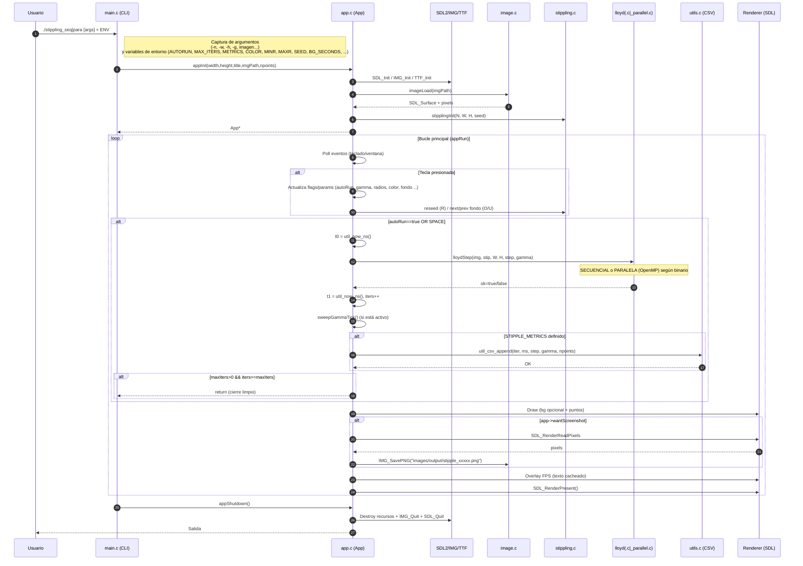
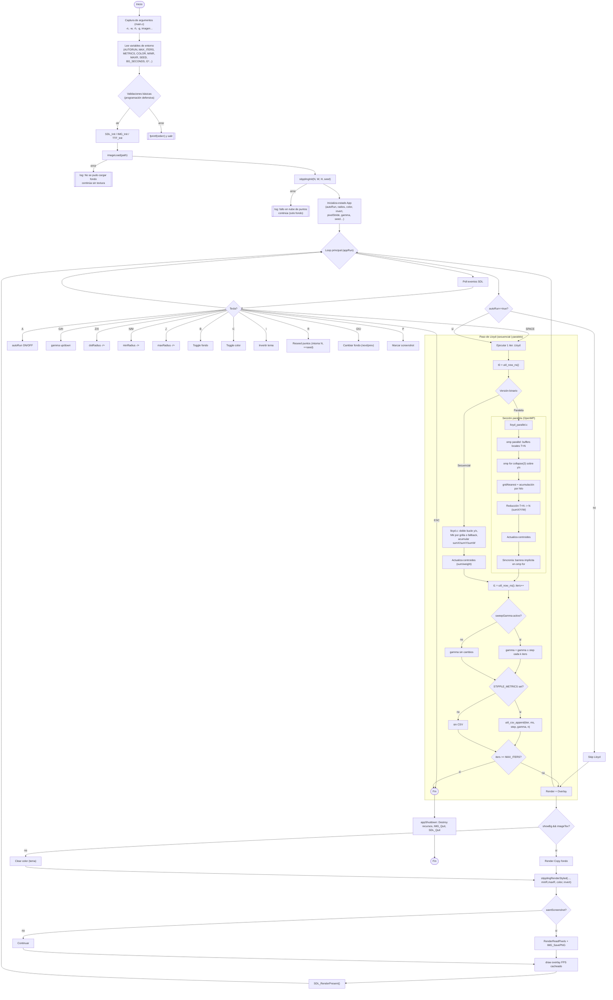

# Diagramas

## Diagrama de secuencia

```mermaid
sequenceDiagram
    autonumber
    participant User as Usuario
    participant CLI as main.c (CLI)
    participant App as app.c (App)
    participant SDL as SDL2/IMG/TTF
    participant Img as image.c
    participant Stip as stippling.c
    participant Lloyd as lloyd(.c|_parallel.c)
    participant CSV as utils.c (CSV)
    participant Rend as Renderer (SDL)

    User->>CLI: ./stippling_seq|para [args] + ENV
    Note right of CLI: Captura de argumentos <br/>(-n, -w, -h, -g, imagen...)<br/>y variables de entorno (AUTORUN, MAX_ITERS, METRICS, COLOR, MINR, MAXR, SEED, BG_SECONDS, ...)

    CLI->>App: appInit(width,height,title,imgPath,npoints)
    App->>SDL: SDL_Init / IMG_Init / TTF_Init
    App->>Img: imageLoad(imgPath)
    Img-->>App: SDL_Surface + pixels
    App->>Stip: stipplingInit(N, W, H, seed)
    App-->>CLI: App*

    loop Bucle principal (appRun)
      App->>App: Poll eventos (teclado/ventana)
      alt Tecla presionada
        App->>App: Actualiza flags/params (autoRun, gamma, radios, color, fondo…)
        App->>Stip: reseed (R) / next/prev fondo (O/U)
      end

      alt autoRun==true OR SPACE
        App->>App: t0 = util_now_ns()
        App->>Lloyd: lloydStep(img, stip, W, H, step, gamma)
        Note over Lloyd: SECUENCIAL o PARALELA (OpenMP) según binario
        Lloyd-->>App: ok=true/false
        App->>App: t1 = util_now_ns(), iters++
        App->>App: sweepGammaTick() (si está activo)
        alt STIPPLE_METRICS definido
          App->>CSV: util_csv_append(iter, ms, step, gamma, npoints)
          CSV-->>App: OK
        end
        alt maxIters>0 && iters>=maxIters
          App-->>CLI: return (cierre limpio)
        end
      end

      App->>Rend: Draw (bg opcional + puntos)
      alt app->wantScreenshot
        App->>Rend: SDL_RenderReadPixels
        Rend-->>App: pixels
        App->>Img: IMG_SavePNG("images/output/stipple_xxxxx.png")
      end
      App->>Rend: Overlay FPS (texto cacheado)
      App->>Rend: SDL_RenderPresent()
    end

    CLI->>App: appShutdown()
    App->>SDL: Destroy recursos + IMG_Quit + SDL_Quit
    App-->>User: Salida
```

## Diagrama de flujo

```mermaid
flowchart TD
  A(["Inicio"]) --> B["Captura de argumentos (main.c)<br/>-n, -w, -h, -g, imagen..."]
  B --> C["Lee variables de entorno<br/>(AUTORUN, MAX_ITERS, METRICS, COLOR, MINR, MAXR, SEED, BG_SECONDS, G*...)"]
  C --> D{"Validaciones básicas<br/>(programación defensiva)"}
  D -->|ok| E["SDL_Init / IMG_Init / TTF_Init"]
  D -->|error| X1[["fprintf(stderr) y salir"]]

  E --> F["imageLoad(path)"]
  F -->|error| X2[["log: No se pudo cargar fondo<br/>continúa sin textura"]]
  F --> G["stipplingInit(N, W, H, seed)"]
  G -->|error| X3[["log: fallo en nube de puntos<br/>continúa (solo fondo)"]]
  G --> H["Inicializa estado App<br/>(autoRun, radios, color, invert,<br/>pixelStride, gamma, seed…)"]
  H --> I{"Loop principal (appRun)"}

  %% Eventos
  I --> J["Poll eventos SDL"]
  J --> K{"Tecla?"}
  K -->|ESC| Z(["Fin"])
  K -->|SPACE| L["Ejecutar 1 iter. Lloyd"]
  K -->|A| A1["autoRun ON/OFF"]
  K -->|G/H| A2["gamma up/down"]
  K -->|Z/X| A3["dotRadius -/+"]
  K -->|N/M| A4["minRadius -/+"]
  K -->|,/.| A5["maxRadius -/+"]
  K -->|B| A6["Toggle fondo"]
  K -->|C| A7["Toggle color"]
  K -->|I| A8["Invertir tema"]
  K -->|R| A9["Reseed puntos (misma N, ++seed)"]
  K -->|O/U| A10["Cambiar fondo (next/prev)"]
  K -->|P| A11["Marcar screenshot"]
  K --> I

  %% Simulación
  I --> M{"autoRun==true?"}
  M -->|sí| L
  M -->|no| R1["Skip Lloyd"] --> R2["Render + Overlay"] --> I

  subgraph S1 ["Paso de Lloyd (secuencial | paralelo)"]
    L --> L1["t0 = util_now_ns()"]
    L1 --> L2{"Versión binario"}
    L2 -->|Secuencial| L3["lloyd.c: doble bucle y/x,<br/>NN por grilla o fallback,<br/>acumular sumX/sumY/sumW"]
    L2 -->|Paralela| P0["lloyd_parallel.c"]
    subgraph PZ ["Sección paralela (OpenMP)"]
      direction TB
      P0 --> P1["omp parallel: buffers locales T×N"]
      P1 --> P2["omp for collapse(2) sobre y/x"]
      P2 --> P3["gridNearest + acumulación por hilo"]
      P3 --> P4["Reducción T×N -> N (sumX/Y/W)"]
      P4 --> P5["Actualiza centroides"]
      P5 --> P6["Sincronía: barrera implícita en omp for"]
    end
    L3 --> L4["Actualiza centroides (sum/weight)"]
    P6 --> L5["t1 = util_now_ns(); iters++"]
    L4 --> L5
    L5 --> L6{"sweepGamma activo?"}
    L6 -->|sí| L7["gamma = gamma ± step cada k iters"]
    L6 -->|no| L8["gamma sin cambios"]
    L7 --> L9
    L8 --> L9{"STIPPLE_METRICS set?"}
    L9 -->|sí| L10["util_csv_append(iter, ms, step, gamma, n)"]
    L9 -->|no| L11["sin CSV"]
    L10 --> L12{"iters >= MAX_ITERS?"}
    L11 --> L12
    L12 -->|sí| Z
    L12 -->|no| R2
  end

  %% Render & salida
  R2 --> R3{"showBg && imageTex?"}
  R3 -->|sí| R4["Render Copy fondo"]
  R3 -->|no| R5["Clear color (tema)"]
  R4 --> R6["stipplingRenderStyled(..., minR,maxR, color, invert)"]
  R5 --> R6
  R6 --> R7{"wantScreenshot?"}
  R7 -->|sí| R8["RenderReadPixels + IMG_SavePNG"]
  R7 -->|no| R9["Continuar"]
  R8 --> R10["draw overlay FPS cacheado"]
  R9 --> R10
  R10 --> R11["SDL_RenderPresent()"]
  R11 --> I

  %% Cierre
  Z --> S["appShutdown: Destroy recursos, IMG_Quit, SDL_Quit"]
  S --> Y(["Fin"])
```
